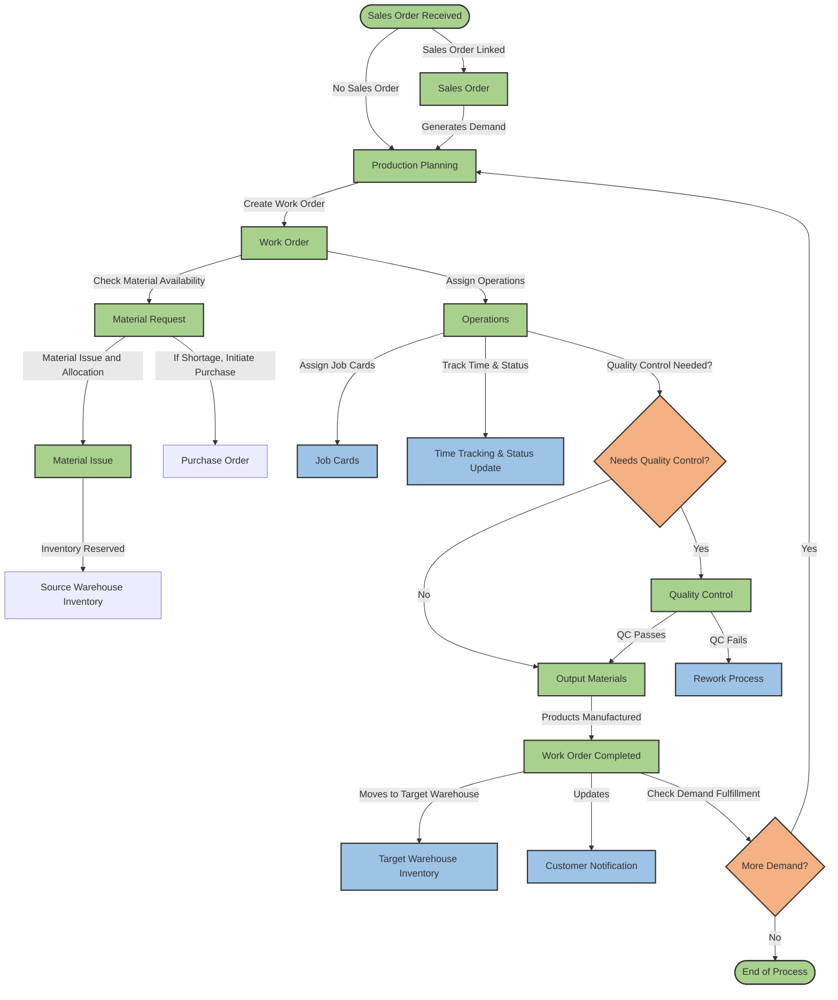

```mermaid
flowchart TD
    %% Start Node
    Start([Sales Order Received])

    %% Sales Order and Production Plan
    Start -->|Sales Order Linked| SO[Sales Order]
    Start -->|No Sales Order| PP[Production Planning]
    SO -->|Generates Demand| PP

    %% Work Order Creation
    PP -->|Create Work Order| WO[Work Order]
    
    %% Work Order to Material Request
    WO -->|Check Material Availability| MR[Material Request]
    MR -->|Material Issue and Allocation| MI[Material Issue]
    MR -->|If Shortage, Initiate Purchase| PUR[Purchase Order]
    MI -->|Inventory Reserved| INV[Source Warehouse Inventory]

    %% Operations in Work Order
    WO -->|Assign Operations| OPS[Operations]
    OPS -->|Assign Job Cards| JC[Job Cards]
    OPS -->|Track Time & Status| TS[Time Tracking & Status Update]
    OPS -->|Quality Control Needed?| QC_Check{Needs Quality Control?}

    %% Quality Control Process
    QC_Check -->|Yes| QC[Quality Control]
    QC_Check -->|No| OP[Output Materials]
    QC -->|QC Passes| OP
    QC -->|QC Fails| RW[Rework Process]

    %% Completion of Work Order
    OP -->|Products Manufactured| Completed[Work Order Completed]
    Completed -->|Moves to Target Warehouse| TW[Target Warehouse Inventory]

    %% Connection to Customer and Production Plan
    Completed -->|Updates| Cust[Customer Notification]
    Completed -->|Check Demand Fulfillment| Demand{More Demand?}
    Demand -->|Yes| PP
    Demand -->|No| End([End of Process])

    %% Legend and Notes
    classDef process fill:#A9D18E,stroke:#333,stroke-width:2px;
    classDef decision fill:#F4B183,stroke:#333,stroke-width:2px;
    classDef action fill:#9DC3E6,stroke:#333,stroke-width:2px;

    %% Applying Class Definitions
    class Start,SO,PP,WO,MR,MI,OPS,QC_Check,QC,OP,Completed,End process;
    class QC_Check,Demand decision;
    class JC,TS,RW,Cust,TW action;
```