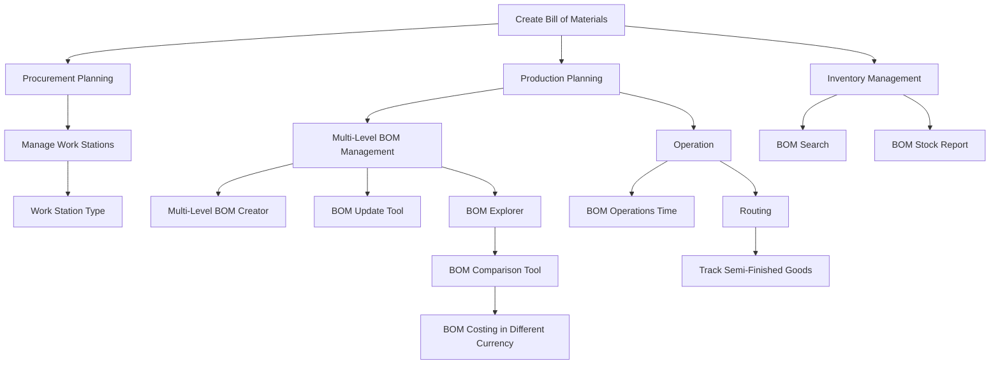

# Bill of Materials in ERPZ

In ERPZ, the Bill of Materials (BOM) flow is a structured process that outlines the components, raw materials, and sub-assemblies required to manufacture a finished product.

It begins with the creation of a BOM, where each item is listed along with its quantity and relationship to the final product. Once the BOM is established, it serves as a reference point for procurement, production planning, and inventory management.

## 1. Key Components of BOM in ERPZ:

- [**Work Station**](): Represents the locations or equipment where production activities are carried out.

- [**Work Station Type**](): Defines the types of workstations that are used in the manufacturing process.

- [**Bill of Materials**](): A detailed list of all components, raw materials, and sub-assemblies needed for production.

- [**Managing Multi-Level BOM**](): A process to manage BOMs with multiple levels of sub-assemblies and components.

- [**Multi-Level BOM Creator**](): A tool to create and manage complex BOMs with multiple hierarchical levels.

- [**BOM Update Tool**](): A utility to update BOMs when components or processes change.

- [**BOM Explorer**](): A tool to visualize and explore the structure of a BOM, including its components and sub-assemblies.

- [**BOM Comparison Tool**](): A feature to compare different BOMs for cost, component differences, and efficiency.

- [**BOM Costing in Different Currency**](): A tool that calculates BOM costs in various currencies for international operations.

- [**BOM Search**](): A search feature to quickly locate BOMs by part number, component, or other criteria.

- [**BOM Stock Report**](): A report showing the current stock levels of materials required for BOMs.

- [**Operation**](): Describes the various processes and steps involved in producing a product as part of the BOM.

- [**BOM Operations Time**](): A tool to track and calculate the time taken for each operation in a BOM.

- [**Routing**](): A feature that helps in defining the path that materials follow through different workstations to complete production.

- [**Track Semi-Finished Goods**](): A tool to monitor and manage semi-finished goods during the production process.

## 2. BOM Process Flow in ERPZ

## 3. Creating a Bill of Materials (BOM) in ERPZ

In ERPZ, a Bill of Materials (BOM) is essential for defining the components needed for manufacturing a product. Follow these steps to create a new BOM:

### 3.1 Accessing the Bill of Materials Section

1. **Navigate to BOM**:
   - From the dashboard, go to the **Manufacturing and Quality** section.
   - Here, you’ll find **Bill of Materials**.
   
   Navigate to:
   > **Dashboard > Manufacturing and Quality > Bill of Materials**

2. **View Existing BOMs**:
   - Once inside the BOM section, you can see a list of existing BOMs.

   

### 3.2 Creating a New BOM

1. **Start a New BOM**:
   - Click on the **Add** button located at the top right corner of the list to create a new BOM.

   

2. **Fill in the BOM Details**:
   - The form includes the following fields:

   

     - **Product**: Select the product from the dropdown list. If desired workspace is not available, then please refer [How to Create An Entity if Not Found](/miscellaneous/create-entity-if-not-found) to understand the process to create one.

     

     - **Number**: This field is auto-generated upon saving.

     

     - **Version**: Enter the version number for the BOM.

     

3. **Define the Formula**:
   - In the **Formula** section, click **Add Row** to add components for the BOM.

   

   - Each row includes the following fields:
     - **Item**: Dropdown list to select the item. If desired workspace is not available, then please refer [How to Create An Entity if Not Found](/miscellaneous/create-entity-if-not-found) to understand the process to create one.

     

     - **Qty**: Specify the quantity required.

     

     - **UoM**: Select the unit of measurement from the dropdown list.

     

     - **Notes**: Add any additional information in the text field.

     

   - You can add as many rows as needed to complete the formula.

4. **Save the BOM**:
   - Once all fields are filled out, click on **Save** to create and save the new BOM.

   

---

This guide provides a step-by-step approach to creating a BOM in ERPZ, ensuring all necessary details are included for accurate product assembly.