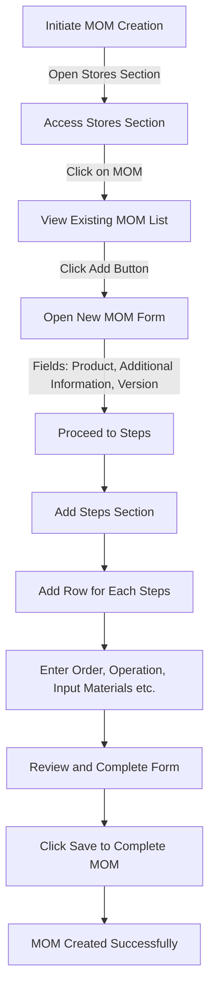

# Manufacturing Method in ERPZ

In ERPZ, the **Manufacturing Method** refers to a structured approach to managing production processes, encompassing everything from planning and scheduling to execution and monitoring. This method allows businesses to efficiently coordinate resources, manage production timelines, and maintain quality standards, ensuring that the manufacturing cycle is optimized for performance and cost-effectiveness.

## 1. Key Components

1. **Production Planning**: Defines the manufacturing requirements based on demand forecasts, available resources, and production capacity.
2. **Bill of Materials (BOM)**: Lists all raw materials, components, and assemblies needed for production, serving as the foundation for material and cost planning.
3. **Work Orders**: Outlines specific production tasks, allocating resources and timeframes to achieve efficient manufacturing flow.
4. **Inventory Management**: Ensures materials are available when needed, minimizing delays and managing costs.
5. **Quality Control**: Maintains product standards through inspections and tests, ensuring customer satisfaction and compliance.

## 2. Significance in ERPZ

The manufacturing method in ERPZ enables businesses to:
- **Enhance Efficiency**: Streamline production processes, reducing lead times and waste.
- **Improve Resource Allocation**: Optimally use labor, materials, and equipment, minimizing downtime and maximizing productivity.
- **Ensure Quality and Compliance**: Implement quality checks that uphold standards and meet regulatory requirements.
- **Gain Real-Time Insights**: Access real-time data on production status, costs, and inventory, facilitating informed decision-making.
- **Increase Profitability**: By optimizing resources and reducing waste, businesses can lower production costs and improve profit margins.

The manufacturing method in ERPZ is crucial for businesses looking to achieve scalable, efficient, and high-quality production processes that adapt to changing market demands.

## 3. Flow Chart of Method of Manufacturing (MOM) Creation in ERPZ

### 3.1 Method of Manufacturing (MOM) Creation Process Flow

This flowchart outlines the steps to create a new Method of Manufacturing (MOM) in ERPZ, from accessing the relevant section to finalizing and saving the MOM.

1. **Initiate MOM Creation**  
   Begin the process by initiating MOM creation.

2. **Accessing Stores Section**  
   - Open the **Stores Section**.
   - Click on **MOM** to view the existing MOM list.

3. **Open New MOM Form**  
   - Click the **Add** button to open a new MOM form.

4. **Complete Detailed Form**  
   - Fill in the fields for **Product**, **Additional Information**, and **Version**.
   - Proceed to the **Steps** section.

5. **Add Steps Section**  
   - In the steps section, click on **Add Row** to define each step.
   - Enter details for each step, including **Order**, **Operation**, **Input Materials**, and other relevant information.

6. **Finalize and Save**  
   - **Review** the completed form.
   - Click **Save** to complete the MOM creation process.

7. **Confirmation**  
   - A success message confirms that the MOM has been created successfully.

This flow ensures a structured and comprehensive setup for each Method of Manufacturing, allowing for detailed steps and materials management.

## 4. How to Create a New Method of Manufacturing in ERPZ

To create a new **Method of Manufacturing (MOM)** in ERPZ, follow the steps below. This process allows you to define the details for a product's manufacturing method, including steps, materials, and quality control checks, ensuring structured and efficient production.

### 4.1 Accessing the Method of Manufacturing Section

1. Navigate to the **Manufacturing and Quality** section in ERPZ.
2. Select **Method of Manufacturing** to view a list of all available MOMs.

> **Dashboard > Stores > Method of Manufacturing(MOM)**

### 4.2 Steps to Create a New MOM

1. **Open the New MOM Form**:
   - Click on the **Add** button located in the top-right corner of the MOM list. This action will open a form for creating a new MOM.

   

   ---

   

2. **Fill in the Main Form Fields**:
   - **Product**: Select the product from a dropdown list of available items.
   - **Additional Information**: Use this text field to add any extra details about the manufacturing process.
   - **Version**: Enter a version number for the MOM in this field.

3. **Adding Manufacturing Steps**:
   - In the **Steps** section, click on **Add Row** to open a new form where you can define the specific steps in the manufacturing process.

   
   
   - **Step Fields**:
     - **Order**: Enter a numerical value to define the sequence of this step.
     - **Operation**: Select the type of operation from a dropdown list.
     - **Input Materials**: Use the multi-select dropdown list to choose the materials required for this step.
     - **Procedure**: Describe the procedure for this step in the text field.
     - **Dependencies**: Specify any dependencies on previous steps.
     - **Output Materials**: Select any materials produced in this step from a multi-select dropdown list.
     - **Needs QC**: Check this box if quality control is required for this step (default: unchecked).
     - **Can Rework**: Check this box if rework is allowed for this step (default: unchecked).
     - **Rework Method**: Choose a rework method from the dropdown list, if applicable.
     - **Duration**: Enter the estimated duration for this step.
     - **Duration Depends on Quantity**: Check this box if the duration of the step is quantity-dependent (default: unchecked).

     

4. **Save the New MOM**:
   - Once you have filled in all necessary fields, click on the **Save** button to create and save the new MOM in ERPZ.

## 5. IF Not Found

If desired option is not available in the searched dropdown for any entity like Input Materials, Operation etc. then please refer [How to Create An Entity if Not Found](/miscellaneous/create-entity-if-not-found) to understand the process to create one.

## 6. Features of the MOM (Method of Manufacturing) Form in ERPZ

The MOM form in ERPZ is designed to standardize and streamline the manufacturing process by defining each step, required resources, and conditions for production. This form helps in managing the manufacturing flow, materials, quality checks, and rework requirements.

### 6.1 Key Features of the MOM Form

1. **Product Selection**  
   Allows selection of the product to be manufactured, centralizing product-specific manufacturing requirements.

2. **Additional Information**  
   A text field for any additional notes or specifications, enabling clarity on product requirements or unique instructions for the MOM.

3. **Version**  
   Indicates the version of the manufacturing method, useful for tracking changes or improvements in the production process over time.

4. **Steps Section**  
   The core of the MOM form where each production step is defined in detail, ensuring comprehensive guidance and process standardization.

### 6.2 Significance of Fields in the MOM Form

- **Product (Dropdown)**  
  Identifies the product this MOM applies to, ensuring that the selected manufacturing method is specific to the product's needs and specifications.

- **Additional Information (Text Field)**  
  Provides space for adding unique information that doesn’t fit into the standard fields, allowing for flexibility and additional instructions relevant to production.

- **Version (Number Field)**  
  Assigns a version to the MOM for revision tracking, enabling production teams to reference specific manufacturing changes and follow updated instructions.

- **Order (Number Field)**  
  Defines the sequence of steps, ensuring each step is completed in the correct order, which is critical for the flow and quality of the final product.

- **Operation (Dropdown List)**  
  Specifies the type of operation to perform at each step, such as cutting, assembling, or testing. This clarifies the actions required at each phase and assigns responsibilities.

- **Input Materials (Multiselect Dropdown)**  
  Lists the materials needed for the step, providing clear guidance on required resources and reducing errors in material selection.

- **Procedure (Text Field)**  
  Describes the specific actions to carry out in each step, offering detailed instructions to ensure accuracy and consistency in execution.

- **Dependencies (Text Field)**  
  Allows specification of dependencies between steps, so each step can be completed only when prerequisites are met, preventing errors from skipping essential steps.

- **Output Materials (Multiselect Dropdown)**  
  Defines the materials or products produced at the step, giving clarity on expected outputs and allowing for quality checks at each stage.

- **Needs QC (Checkbox)**  
  Indicates if quality control is necessary for the step, helping to maintain quality standards by flagging steps that require additional inspection.

- **Can Rework (Checkbox)**  
  Allows specification of whether a step can be repeated if issues arise, enabling flexibility and rework to correct errors or defects.

- **Rework Method (Dropdown List)**  
  Defines the method for rework if needed, providing instructions on how to correct any issues, which is vital for maintaining quality without halting production.

- **Duration (Number Field)**  
  Estimates the time required for the step, assisting in scheduling and ensuring time management across production processes.

- **Duration Depends on Quantity (Checkbox)**  
  Indicates if the duration is variable based on the quantity produced, allowing for more accurate time estimates, especially in scalable production.

### 6.3 Benefits of Using the MOM Form in ERPZ

The MOM form in ERPZ enables standardized and organized production processes, minimizes errors, and ensures that all steps are documented and traceable. By utilizing the MOM form:

- **Quality and Consistency** are maintained as each step is outlined in detail.
- **Efficiency** is increased with clear guidelines, dependencies, and time estimates.
- **Flexibility** is provided through options for rework, ensuring that production continues smoothly.
- **Traceability** and **Version Control** enable tracking of improvements and changes in manufacturing processes.

The MOM form is a vital tool in ERPZ to optimize manufacturing operations, ensuring that each product is made according to precise standards.

## 7. Conclusion

The Method of Manufacturing (MOM) in ERPZ is an essential tool for streamlining and standardizing production processes. By defining each manufacturing step, required resources, dependencies, and quality control measures, MOM provides a comprehensive framework that ensures consistency, quality, and efficiency. The form’s structured approach to specifying materials, procedures, and rework options allows manufacturers to optimize operations, reduce errors, and maintain high standards across production.

Incorporating MOM in ERPZ enables teams to monitor and adapt to changes, fostering continuous improvement and providing the flexibility to meet evolving production demands. As a result, MOM empowers businesses to scale effectively, ensure product quality, and maintain a competitive edge in manufacturing.

