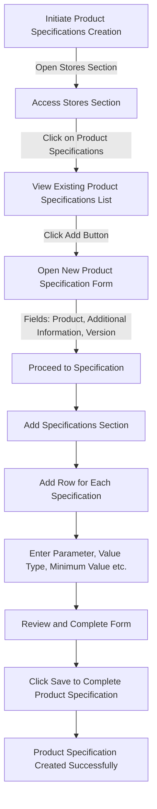

# Product Specifications in ERPZ

Product Specifications in ERPZ allow businesses to clearly define and document the unique attributes, quality standards, and requirements for each product they manufacture or manage. This feature enables users to establish precise guidelines for materials, dimensions, quality checks, and other specific product characteristics, ensuring that products meet desired standards and customer expectations.

## 1. Significance of Product Specifications in ERPZ

1. **Enhanced Quality Control**  
   By defining clear product specifications, ERPZ enables consistent quality across production batches. Specifications serve as a reference for quality control (QC) checks, helping teams ensure that each product meets predefined standards and reduces the risk of defects.

2. **Improved Communication**  
   Detailed product specifications help communicate requirements across teams, from procurement to production. This minimizes misunderstandings and ensures that all departments are aligned in meeting product standards.

3. **Streamlined Manufacturing Process**  
   Product specifications guide the manufacturing process by defining exact requirements for materials, dimensions, and tolerances. This allows for streamlined operations, as production teams have clear instructions on how to achieve the required product outcomes.

4. **Compliance and Traceability**  
   Specifications serve as a record for compliance, especially in regulated industries where product standards must meet specific guidelines. Documenting specifications also enhances traceability, making it easier to track and resolve issues if they arise in the future.

5. **Customization and Flexibility**  
   ERPZ’s Product Specifications feature allows businesses to tailor specifications for different product variants, supporting customization and flexibility to meet diverse customer needs.

6. **Cost and Waste Reduction**  
   With accurate specifications, production teams can avoid mistakes, reduce waste, and optimize resource usage, leading to cost savings and improved sustainability.

Product Specifications in ERPZ are vital for maintaining product quality, aligning teams, and ensuring that production meets both internal and external standards. This feature empowers businesses to deliver high-quality products while optimizing processes and maintaining compliance.

## 2. Flow Chart of Product Specifications Creation in ERPZ

### 2.1 Product Specifications Creation Process Flow

This flowchart outlines the steps for creating a new Product Specification in ERPZ, from accessing the relevant section to finalizing and saving the specifications.

1. **Initiate Product Specifications Creation**  
   Begin the process by initiating the creation of Product Specifications.

2. **Accessing Stores Section**  
   - Navigate to the **Stores Section**.
   - Click on **Product Specifications** to view the list of existing specifications.

3. **Open New Product Specification Form**  
   - Click the **Add** button to open a new Product Specification form.

4. **Complete Detailed Form**  
   - Fill in the primary fields, including **Product**, **Additional Information**, and **Version**.
   - Proceed to the **Specifications** section.

5. **Add Specifications Section**  
   - In the Specifications section, click **Add Row** to define each parameter.
   - Enter details for each parameter, including **Parameter Name**, **Value Type**, **Minimum Value**, and other relevant information.

6. **Finalize and Save**  
   - **Review** the completed form to ensure accuracy.
   - Click **Save** to complete the creation of the Product Specification.

7. **Confirmation**  
   - A success message confirms that the Product Specification has been created successfully.

This flow ensures a structured and thorough setup for each Product Specification, providing detailed guidelines to standardize and control product quality.

## 3. How to Create a New Product Specification in ERPZ

To create a new Product Specification in ERPZ, follow these steps to ensure that all necessary information is accurately recorded.

1. **Navigate to Manufacturing and Quality Section**  
   - Access the **Manufacturing and Quality** section within ERPZ.

2. **Locate Product Specification**  
   - In this section, find and click on **Product Specification** to view the list of existing specifications.

   > **Dasboard > Manufacturing and Quality > Product Specifications**

   

   ---

3. **Open the New Product Specification Form**  
   - Click on the **Add** button located at the top right corner of the Product Specifications list. This action will open a new form for creating a Product Specification.

   

   ---

   

   ---

4. **Fill in the Product Specification Form**  
   - The form will contain the following fields:
     - **Product**: A dropdown list to select the relevant product.
     - **Description**: A text field to provide additional information about the product.
     - **Version**: A number field to specify the version of the product specification.

5. **Add Specifications**  
   - Navigate to the **Specifications Section** within the form.
   - To add specifications, click on the **Add Row** button. 

   

   This will open another form where you will fill in the following fields:
     - **Parameter**: The specific characteristic of the product being defined.
     - **Value Type**: A dropdown list to specify the type of value (e.g., numeric, text).
     - **Minimum Value**: The lowest acceptable value for the parameter.
     - **Maximum Value**: The highest acceptable value for the parameter.
     - **Exact Value**: The specific value for the parameter, if applicable.
     - **Options**: Additional choices related to the parameter.
     - **UOM**: A dropdown list to select the unit of measurement for the parameter.
     - **Test**: A dropdown list to specify the testing method or requirements for the parameter.

     

     ---

6. **Save the Product Specification**  
   - After filling in all the required fields, review the information to ensure accuracy.
   - Click on the **Save** button to create the new Product Specification.

Following these steps will help you successfully create a comprehensive Product Specification in ERPZ, facilitating better quality control and management of manufacturing processes.

## 4. IF Not Found

If desired option is not available in the searched dropdown for any entity like Product, Test etc. then please refer [How to Create An Entity if Not Found](/miscellaneous/create-entity-if-not-found) to understand the process to create one.

## 5.Features and Significance of the Product Specification Form

The Product Specification form in ERPZ is designed to capture essential details about products, ensuring consistency and quality throughout the manufacturing process. Below are the key features of the form and the significance of each field.

### 5.1 Key Features of the Product Specification Form

1. **Structured Input Fields**  
   The form is organized with clearly defined sections, making it easy for users to input relevant information systematically.

2. **Dropdown Menus**  
   Dropdowns are utilized for certain fields, ensuring that users select from predefined options, which helps maintain data integrity and consistency.

3. **Dynamic Row Addition**  
   Users can dynamically add multiple specifications within the form, allowing for comprehensive product descriptions without needing to create separate entries.

4. **Validation of Entries**  
   Certain fields include validation criteria (e.g., minimum and maximum values), ensuring that only accurate and relevant data is entered.

### 5.2 Significance of Each Field

#### 5.2.1 Product (Dropdown List)
- **Significance**: This field allows users to select the specific product for which the specifications are being created. It ensures that the specifications are associated with the correct product, facilitating better tracking and management.

#### 5.2.2 Description (Text Field)
- **Significance**: The description provides additional context or details about the product. This information is crucial for understanding product features, intended use, and any special instructions, helping teams maintain clarity on product requirements.

#### 5.2.3 Version (Number Field)
- **Significance**: The version field allows users to specify which version of the product specification they are creating. This is important for maintaining a history of changes and updates, ensuring that teams always refer to the correct specification version.

#### 5.2.4 Specifications Section
- **Significance**: This section captures detailed parameters that define the product's quality and performance standards.

#### 5.2.5 Parameter (Field)
- **Significance**: Identifies the specific characteristics being measured or defined, such as dimensions, weight, or capacity. This helps standardize what is expected from the product.

##### 5.1 Value Type (Dropdown List)
- **Significance**: Indicates the type of value (e.g., numeric, text) for the parameter. This clarity aids in data consistency and ensures that values are entered in the appropriate format.

##### 5.2 Minimum Value (Field)
- **Significance**: Defines the lowest acceptable value for the parameter, ensuring that products meet basic quality standards and requirements.

##### 5.3 Maximum Value (Field)
- **Significance**: Specifies the highest acceptable value for the parameter. Together with the minimum value, it helps maintain quality control by setting clear boundaries.

##### 5.4 Exact Value (Field)
- **Significance**: Allows for the specification of a precise value if applicable. This field is crucial for parameters that require strict adherence to exact measurements.

##### 5.5 Options (Field)
- **Significance**: Provides additional choices related to the parameter. This flexibility is essential for capturing variations in specifications based on product lines or customer needs.

##### 5.6 UOM (Dropdown List)
- **Significance**: The unit of measurement dropdown ensures that all parameters are measured consistently, which is vital for production accuracy and compliance.

##### 5.7 Test (Dropdown List)
- **Significance**: Identifies the testing method or requirements for the parameter, ensuring that appropriate quality checks are established and adhered to, enhancing product reliability.

By leveraging these features and understanding the significance of each field, users can effectively create detailed and accurate product specifications in ERPZ, ultimately supporting enhanced quality control and operational efficiency.

## 6. Conclusion

Product specifications play a crucial role in the manufacturing and quality assurance processes within ERPZ. By clearly defining the parameters, characteristics, and quality standards for each product, organizations can ensure consistency and reliability in their offerings. The structured format of the Product Specification form facilitates easy data entry and validation, enabling teams to maintain accurate and comprehensive records.

Through effective management of product specifications, companies can enhance their production processes, minimize errors, and improve overall product quality. Additionally, having well-documented specifications fosters better communication among stakeholders, including production, quality control, and marketing teams. This alignment is vital for meeting customer expectations and adhering to regulatory requirements.

In conclusion, the implementation of a robust Product Specification system in ERPZ not only streamlines operations but also contributes significantly to the organization's commitment to quality and continuous improvement. By investing in this foundational element, businesses can achieve greater operational efficiency and drive long-term success in a competitive marketplace.

