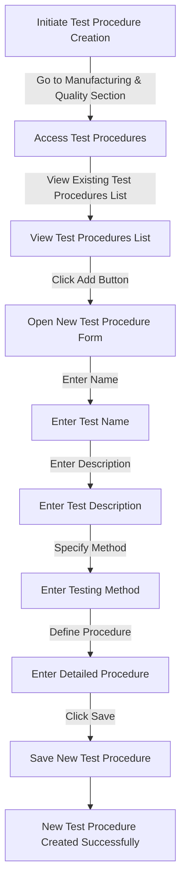

# Test Procedures in ERPZ

In ERPZ, **Test Procedures** are a structured set of steps and guidelines that ensure quality and compliance within manufacturing and inventory processes. Each test procedure includes a **Test Name** and a **Description**, providing users with an overview of what the test entails and its objectives.

## 1. Key Significance of Test Procedures

- **Standardized Quality Control**: Test procedures define standardized methods to verify product quality and performance, reducing variability in results and ensuring consistent quality.
- **Detailed Documentation**: By documenting each test with clear descriptions, ERPZ helps users understand the purpose of each test and the criteria it evaluates.
- **Regulatory Compliance**: Many industries have strict quality standards. Test procedures help businesses adhere to regulatory requirements and demonstrate compliance with industry norms.
- **Improved Traceability**: Recording and managing test procedures in ERPZ enhances traceability, making it easier to audit processes and identify areas of improvement.

## 2. Importance in ERPZ

Test Procedures in ERPZ play a vital role in maintaining quality assurance, boosting reliability in products, and aligning with industry standards. This functionality supports businesses in achieving high-quality outcomes by enforcing structured testing protocols throughout the production and inventory management processes.

## 3. Flow Chart of Test Procedure Creation in ERPZ

### 3.1 Test Procedure Creation Flowchart Explanation

The flowchart outlines the steps for creating a new test procedure in ERPZ:

1. **Initiate Process**: Begin by navigating to the **Manufacturing & Quality** section from the dashboard.
2. **Access Test Procedures**: Click on **Test Procedures** to view the list of available test procedures.
3. **Open Form**: To create a new test procedure, click the **Add** button at the top-right corner to open the form.
4. **Fill Form Details**: Enter details such as:
   - **Name**: Specify the test name.
   - **Description**: Provide a brief description of the test.
   - **Method**: Detail the testing method.
   - **Procedure**: Provide a detailed procedure for the test.
5. **Save Procedure**: After completing the form, click **Save** to create and store the new test procedure.

This flow ensures that each test procedure is thoroughly documented with clear instructions and methods, contributing to standardized quality control in ERPZ.

## 4. How to Create a New Test Procedure in ERPZ

In ERPZ, **Test Procedures** allow you to define and document quality testing processes to ensure product compliance and maintain high standards. The following steps guide you through creating a new test procedure.

### 4.1 Steps to Create a New Test Procedure

1. **Access the Test Procedures Section**:  
   Navigate to the **Manufacturing & Quality** section from the ERPZ dashboard. Under this section, locate and click on **Test Procedures**. This will display a list of all existing test procedures.

   
   ---

2. **Start a New Test Procedure**:
   - At the top right corner of the list, click on the **Add** button to initiate a new test procedure.

   
   ---

   - A form will open, containing various fields that allow you to define the procedure's details.

   
   ---

3. **Complete the Form Fields**:
   - **Name**: Provide a unique name for the test, making it easy to identify and reference.
   - **Description**: Briefly describe the purpose of the test, outlining what it aims to assess or ensure in terms of quality or compliance.
   - **Method**: Specify the testing method, which may include a particular technique, equipment, or measurement standard used in this test.
   - **Procedure**: Use this text field to explain the test steps in detail. This section should include each phase of the test, covering the setup, execution, and evaluation processes, so that any team member can follow and perform the test accurately.

4. **Save the Test Procedure**:
   - After filling out all fields, click on the **Save** button. This action will create a new test procedure and add it to the list of available procedures.

   
   ---

## 5. Key Features and Field Significance

- **Name**: Identifies the test uniquely within the system for easy tracking.
- **Description**: Provides a summary for quick reference, helping users understand the purpose of each test.
- **Method**: Outlines the specific testing method, which can vary based on the requirements of the product being tested.
- **Procedure**: A detailed guide that ensures consistency and accuracy in conducting the test, which is crucial for maintaining quality standards.

## 6. Benefits of Documenting Test Procedures

Defining test procedures in ERPZ helps to ensure that testing methods are clear, consistent, and accessible across teams. This process contributes to maintaining high-quality standards by ensuring that each product is tested following structured, documented guidelines.

## Conclusion

Test procedures in ERPZ are essential for maintaining high standards of quality and consistency across manufacturing and quality control processes. By clearly defining each test with detailed methods and procedures, ERPZ ensures that all quality assessments are standardized, repeatable, and aligned with the organization’s quality goals. This feature aids in achieving reliable product outcomes, minimizing defects, and upholding compliance with industry standards, making it a critical tool for efficient and effective quality management.

