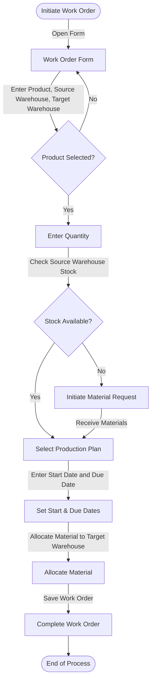

# Work Order

A Work Order is a document given to the manufacturing shop floor by the Production Planner as a signal to manufacture a certain quantity of a certain Item.

The Work Order also helps generate the material requirements (Stock Entry) for the Item to be produced from its Bill of Materials.

The Work Order can be generated from the Production Plan based on Sales Orders.

## 1. Prerequisites

Before creating and using a Work Order, it is advised that you create the following first:

- Bill Of Materials
- Operation
- Workstation

## 2. Flow Chart of Work Order Creation in ERPZ

### 2.1 Flowchart Explanation

1. **Initiate Work Order**: Begins by opening the Work Order form.
2. **Product and Quantity Selection**: Ensures the product is selected and checks if the Source Warehouse has sufficient stock.
3. **Production Plan and Dates**: Selects a Production Plan, then sets the Start Date and Due Date based on production requirements.
4. **Material Allocation**: Allocates the required materials to the Target Warehouse.
5. **Save and Complete**: Saves and finalizes the Work Order, completing the process.

This flowchart visually captures the process of creating a Work Order based on these key fields, helping to organize the workflow efficiently.

## 3. Creating a Work Order in ERPZ

To create a new Work Order in ERPZ, follow these steps:

### 3.1 Navigate to Manufacturing and Quality Section  
   From **Dashboard** go to the **Manufacturing and Quality** section in the ERPZ application. Here, you'll find the **Work Orders**.

   > **Dashboard > Manufacturing and Quality > Work orders**

   

### 3.2 Access Existing Work Orders  
   Inside the **Work Order**, you'll see a list of all existing work orders. This list helps you keep track of current and past work orders.

### 3.3 Create a New Work Order  
   To create a new Work Order, click on the **Add** button in the top right corner of the list. This will open a form where you can fill in the necessary details.

   

   ---

   

### 3.4 Fill Out the Work Order Form  
   The form contains various fields to provide specific details for the new Work Order:

   - **Product**: Select the product to be manufactured from the dropdown list.

   

   - **Source Warehouse**: Specify the warehouse where materials are sourced from.

   

   - **Target Warehouse**: Specify the warehouse where the finished product will be stored.

   

   - **Quantity**: Enter the quantity to be produced.

   

   - **Start Date** and **Due Date**: Specify the dates for production start and completion.

   

   - **Production Plan**: Link a production plan if available.

   

### 3.5 Save the Work Order
   After filling in all necessary fields and sections, click **Save** to create the new Work Order.

   

By following these steps, you can successfully create a detailed and structured Work Order in ERPZ.

## 4. IF Not Found

If desired option is not available in the searched dropdown for any entity like Source Warehouse, Target Warehouse etc. then please refer [How to Create An Entity if Not Found](/miscellaneous/create-entity-if-not-found) to understand the process to create one.

## 5. Additional Work Order Features

### 5.1 Inventory Reservation for Materials
- **Description**: When a Work Order is created, automatically reserve the required materials in the **`Source Warehouse`**.
- **Fields Required**: **`Product`**, **`Quantity`**, **`Source Warehouse`**.
- **Benefit**: Helps prevent inventory shortages by ensuring materials are set aside, avoiding conflicts with other orders or requests.

### 5.2 Production Cost Calculation
- **Description**: Calculate the estimated cost of the Work Order based on materials, labor, and overheads.
- **Fields Required**: **`Quantity`** and potentially additional cost fields for labor and overheads.
- **Benefit**: Provides an overview of production costs, aiding in pricing decisions and profitability analysis.

### 5.3 Work Order Scheduling and Calendar View
- **Description**: Display all active Work Orders on a calendar view based on the **`Start Date`** and **`Due Date`**.
- **Fields Required**: **`Start Date`**, **`Due Date`**.
- **Benefit**: Enables users to view scheduled work orders, plan resources, and avoid scheduling conflicts, especially useful for high-volume production.

### 5.4 Auto-Suggestion for Production Plan Based on Demand
- **Description**: When creating a Work Order, auto-suggest production plans based on current demand and available stock.
- **Fields Required**: **`Production Plan`**, **`Quantity`**, and inventory checks.
- **Benefit**: Helps streamline production by pre-emptively creating work orders for products with high demand.

### 5.5 Product Auto-Selection
   - **Description**: Automatically filters and displays the products based on previously created Bill of Materials (BOM) or based on production demands.
   - **Benefit**: Saves time and reduces errors by narrowing down products to only those relevant to production needs.

### 5.6 Source and Target Warehouse Availability Check
   - **Description**: Checks stock levels in the Source Warehouse to ensure adequate material availability for the order. Displays warning if stock is insufficient.
   - **Benefit**: Prevents work order delays and prompts proactive restocking or material request generation when materials are low.

### 5.7 Quantity Validation
   - **Description**: Validates the entered quantity based on the availability in the Source Warehouse and the requirements set by the production plan.
   - **Benefit**: Ensures production aligns with available stock and planned demand, helping to maintain accurate inventory levels.

### 5.8 Warehouse Transfer Notifications
   - **Description**: Triggers a notification or alert to warehouse managers once the work order is completed and materials need to be transferred to the Target Warehouse.
   - **Benefit**: Enhances coordination between departments, ensuring smooth material flow and updated stock levels in the target warehouse.

### 5.9 Real-Time Inventory Updates
   - **Description**: Automatically adjusts inventory levels in both Source and Target Warehouses upon work order completion, reflecting the new quantities without manual updates.
   - **Benefit**: Keeps inventory records accurate and updated, reducing the risk of stock discrepancies and improving data accuracy for future planning.

---

## 6. Conclusion

The Work Order feature in ERPZ provides a comprehensive approach to managing production tasks, materials, and operations, ensuring that each step in the manufacturing process is efficiently tracked and organized. By following a structured Work Order creation process and implementing these additional features, ERPZ users can optimize resource allocation, improve production accuracy, and enhance quality control. This combination of functionality helps drive productivity, reduces waste, and ultimately contributes to more effective manufacturing operations.

