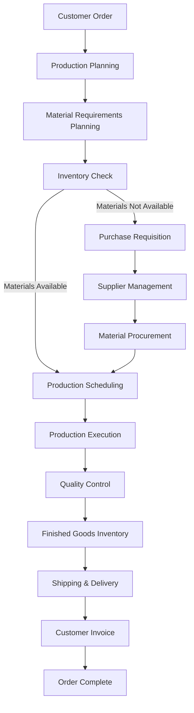

import Pagination from '../../components/Pagination';
import pages from '../../utils/order';

# Basics of Manufacturing in ERPZ

ERPZ comes fully equipped to meet all the requirements of a manufacturing business, such as maintaining warehouses, workstations/machines, operations, finished goods, raw materials, Bill of Materials (BOM) tracking, work order planning and execution, procurement, and much more.

## 1. Master Data

The Manufacturing module in ERPZ helps you maintain essential master data, including warehouses (locations), workstations, operations, finished goods, and raw materials. For manufacturing operations, their respective workstations are critical and can be configured based on the finished goods in the Bill of Materials. Warehouses are utilized to store both raw materials and finished goods. In ERPZ, users can create separate warehouses to effectively manage raw materials and finished goods.

### More details are as follows:
- **Warehouse:** Manage storage locations for raw materials and finished goods.
- **Workstation / Machine:** Configure machines and workstations for various manufacturing processes.
- **Operation:** Define operations necessary for manufacturing finished goods.
- **Raw Material / Finished Good:** Track raw materials and finished goods inventory.
- **Routing:** Plan the flow of operations and materials through different workstations.

## 2. Transaction Data

The Manufacturing module in ERPZ supports the maintenance of multi-level Bills of Materials (BOMs) for your items. This feature aids in product costing, production planning, creating work orders for your manufacturing shop floors, generating job cards, and managing inventory by determining material requirements via BOMs (also referred to as Material Requirements Planning or MRP).

### More details are as follows:
- **Bill Of Materials:** Create and manage multi-level BOMs for products.
- **Work Order:** Plan and track work orders for manufacturing processes.
- **Job Card:** Generate job cards for specific manufacturing tasks.
- **Disassembly Order:** Manage orders for disassembly and recycling of finished goods.
- **Production Plan:** Develop comprehensive production plans based on forecasts and orders.

## 3. Types of Production Planning

Broadly, there are three types of Production Planning Systems in ERPZ:

- **Make to Stock:** Production is planned based on forecasts, with items sold to distributors or customers. Common examples include fast-moving consumer goods like soaps or packaged water.
  
- **Make to Order:** Items are manufactured only after a customer places a specific order. For example, custom wedding cakes fall into this category.

- **Engineer to Order:** Each sale is a separate project designed to meet specific customer requirements. This includes custom furniture, machine tools, specialty devices, and metal fabrication.

Most small and medium-sized manufacturing businesses operate on a make-to-order or engineer-to-order system, which aligns with ERPZ's functionalities. For engineer-to-order systems, the Manufacturing module should be utilized in conjunction with the Project module.

## 4. Manufacturing Impact on Inventory

In ERPZ, the status of work orders is contingent upon the stock transactions made against them. Raw materials required for producing finished goods can be transferred from storage to the Work In Progress (WIP) warehouse. From the WIP warehouse, these raw materials can be consumed via stock entry. Users have the option to either bulk consume the raw materials and then add the finished goods or consume the materials first and subsequently add the finished goods.

## 5. ERPZ Manufacturing Demo

To explore the features of the manufacturing module in ERPZ, check out the following video demo.

## Manufacturing Workflow

The following diagram illustrates the workflow for manufacturing in ERPZ:

<Pagination
  pages={pages}
/>