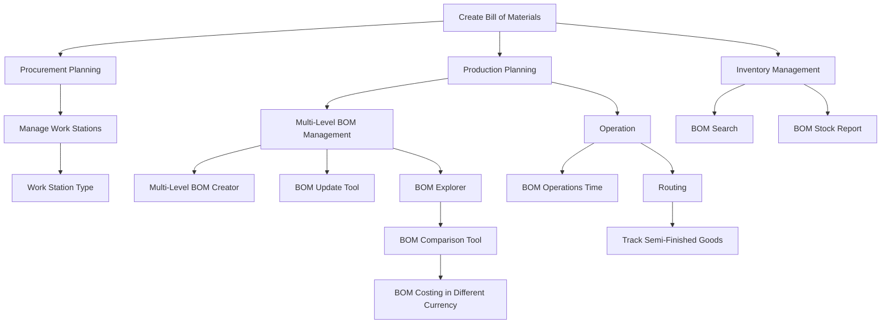

import Pagination from '../../../components/Pagination';
import pages from '../../../utils/order';
import { Callout } from 'nextra/components';

# Bill of Materials in ERPZ

In ERPZ, the Bill of Materials (BOM) flow is a structured process that outlines the components, raw materials, and sub-assemblies required to manufacture a finished product.

It begins with the creation of a BOM, where each item is listed along with its quantity and relationship to the final product. Once the BOM is established, it serves as a reference point for procurement, production planning, and inventory management.

## Key Components of BOM in ERPZ:

- [**Work Station**](/manufacturing/bom/work-station): Represents the locations or equipment where production activities are carried out.

- [**Work Station Type**](/manufacturing/bom/work-station-type): Defines the types of workstations that are used in the manufacturing process.

- [**Bill of Materials**](/manufacturing/bom/bill-of-materials): A detailed list of all components, raw materials, and sub-assemblies needed for production.

- [**Managing Multi-Level BOM**](/manufacturing/bom/managing-multi-level-bom): A process to manage BOMs with multiple levels of sub-assemblies and components.

- [**Multi-Level BOM Creator**](/manufacturing/bom/multi-level-bom-creator): A tool to create and manage complex BOMs with multiple hierarchical levels.

- [**BOM Update Tool**](/manufacturing/bom/bom-update-tool): A utility to update BOMs when components or processes change.

- [**BOM Explorer**](/manufacturing/bom/bom-explorer): A tool to visualize and explore the structure of a BOM, including its components and sub-assemblies.

- [**BOM Comparison Tool**](/manufacturing/bom/bom-comparison-tool): A feature to compare different BOMs for cost, component differences, and efficiency.

- [**BOM Costing in Different Currency**](/manufacturing/bom/bom-costing-different-currency): A tool that calculates BOM costs in various currencies for international operations.

- [**BOM Search**](/manufacturing/bom/bom-search): A search feature to quickly locate BOMs by part number, component, or other criteria.

- [**BOM Stock Report**](/manufacturing/bom/bom-stock-report): A report showing the current stock levels of materials required for BOMs.

- [**Operation**](/manufacturing/bom/operation): Describes the various processes and steps involved in producing a product as part of the BOM.

- [**BOM Operations Time**](/manufacturing/bom/bom-operations-time): A tool to track and calculate the time taken for each operation in a BOM.

- [**Routing**](/manufacturing/bom/routing): A feature that helps in defining the path that materials follow through different workstations to complete production.

- [**Track Semi-Finished Goods**](/manufacturing/track-semi-finished-goods): A tool to monitor and manage semi-finished goods during the production process.

## BOM Process Flow in ERPZ

<Pagination
  pages={pages}
/>