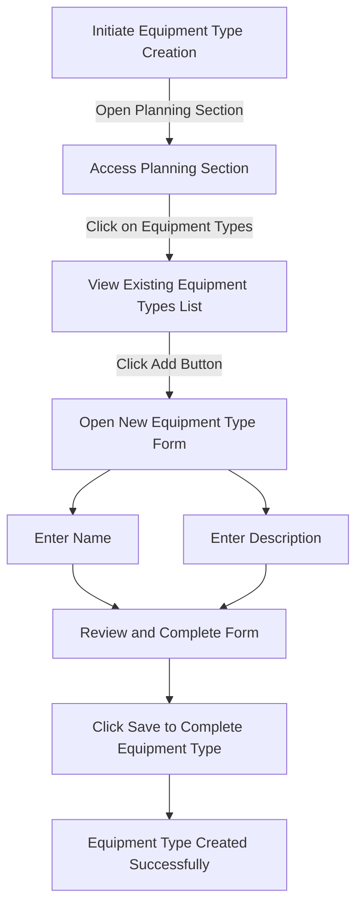

# Equipment Types in ERPZ

In ERPZ, the Equipment Types section is a crucial component that organizes and categorizes all the equipment used in production processes. This section provides users with a comprehensive list of all equipment types, including their names and descriptions. By defining and managing various equipment types, ERPZ enables businesses to optimize their production capabilities and streamline operations.

## 1. Features of Equipment Types
- **Categorization**: Equipment types are categorized into distinct groups, allowing users to easily identify and manage different classes of equipment. This categorization might include types such as "Assembly Machines," "Painting Equipment," "Packaging Equipment," etc.
  
- **Descriptive Information**: Each equipment type comes with a detailed description that outlines its specific functions, capabilities, and any pertinent characteristics. This information aids in understanding the role of each equipment type in the production process.

- **User-Friendly Interface**: The Equipment Types section is designed for ease of use, allowing users to quickly navigate and find the information they need about various equipment types.

## 2. Significance of Equipment Types in ERPZ

1. **Improved Inventory Management**:
   - Equipment types help in maintaining an organized inventory system. By categorizing equipment, businesses can track the availability and usage of different types more effectively, reducing the risk of overstocking or underutilization.

2. **Enhanced Resource Allocation**:
   - Knowing the types of equipment available allows for better planning and allocation of resources. This ensures that the right equipment is used for specific tasks, improving overall operational efficiency.

3. **Facilitated Maintenance Scheduling**:
   - With a clear understanding of the different equipment types, maintenance can be scheduled more effectively. Specific maintenance protocols can be established for each type, helping to prolong the lifespan of the equipment and minimize downtime.

4. **Data-Driven Decision Making**:
   - Access to detailed descriptions and categorizations of equipment types allows management to make informed decisions regarding investments in new equipment or upgrades to existing ones. Understanding the capabilities of different equipment types can lead to better strategic planning.

5. **Compliance and Safety Management**:
   - Equipment types often come with specific safety standards and compliance requirements. By categorizing equipment, ERPZ helps ensure that all safety protocols are adhered to, promoting a safer working environment.

## 3. Flow Chart of Equipment Type Creation in ERPZ

### 3.1 Equipment Type Creation Flow Chart Explanation

This flow chart outlines the step-by-step process of creating a new equipment type in ERPZ.

1. **Initiate Equipment Type Creation**: Start by accessing the **Planning** section from the dashboard.
2. **Access Equipment Types**: Go to the **Equipment Types** option to view a list of existing equipment types.
3. **Open New Equipment Type Form**: Click the **Add** button to open the form for creating a new equipment type.
4. **Enter Details**:
   - **Name**: Input the name of the new equipment type.
   - **Description**: Provide a description of the equipment type's purpose or characteristics.
5. **Review and Save**: After entering all details, review the form, and click **Save** to complete the process.

Once saved, the new equipment type is added to the list, allowing for its future use in planning and resource allocation within ERPZ.

## 4. Creating Equipment Types in ERPZ

### 4.1 Accessing Equipment Types
To view and manage equipment types in ERPZ, follow these steps:

1. Go to the **Planning** section from the dashboard.
2. Select **Equipment Types** from the menu. This will display a list of all existing equipment types, including their names and descriptions.

> **Dashboard > Planning > Equipment Types**

### 4.2 Creating a New Equipment Type

If you need to add a new equipment type, follow these steps:

1. In the **Equipment Types** section, click on the **Add** button located at the top-right corner of the equipment type list. This will open the equipment type form.

---

  
2. The form includes the following fields:
   - **Name**: A text field where you enter the name of the equipment type.

   

   - **Description**: A text field for providing a detailed description of the equipment type's purpose or function.

   

3. After filling in both fields, click on **Save** to create the new equipment type. 

Once saved, the new equipment type will appear in the list, allowing it to be utilized in future planning and resource management tasks within ERPZ.

## 5. Equipment Type Form Features and Field Significance

The Equipment Type form in ERPZ allows users to define specific categories for different types of equipment used in production, enabling better organization and management of resources. Here’s a breakdown of the form’s features and the significance of each field.

### 5.1 Key Features of the Equipment Type Form

1. **Intuitive Interface**: The form is simple, allowing for quick entry and easy navigation.
2. **Essential Fields**: Focused fields that gather the most critical information about equipment types.
3. **Standardized Categories**: Enables the categorization of equipment to maintain consistency across the production environment.
4. **Flexible Descriptions**: Allows users to provide detailed descriptions to differentiate equipment types effectively.

### 5.2 Field Significance

- **Name**:
  - **Purpose**: This text field captures the name of the equipment type, serving as its unique identifier.
  - **Significance**: A clearly defined name helps ensure that equipment types are easily recognizable and searchable within the ERPZ system. It enables staff to quickly associate machinery or tools with specific production processes.

- **Description**:
  - **Purpose**: This text field allows for an optional description of the equipment type.
  - **Significance**: The description field provides additional context about the purpose or functionality of the equipment type. This can help distinguish similar equipment types from one another, aiding in better equipment planning and allocation for various production tasks.

## 6. Conclusion
The Equipment Types section in ERPZ plays a vital role in managing production resources efficiently. By categorizing equipment and providing detailed descriptions, ERPZ facilitates better inventory management, resource allocation, and maintenance planning, ultimately contributing to enhanced operational effectiveness and strategic decision-making in the organization.
