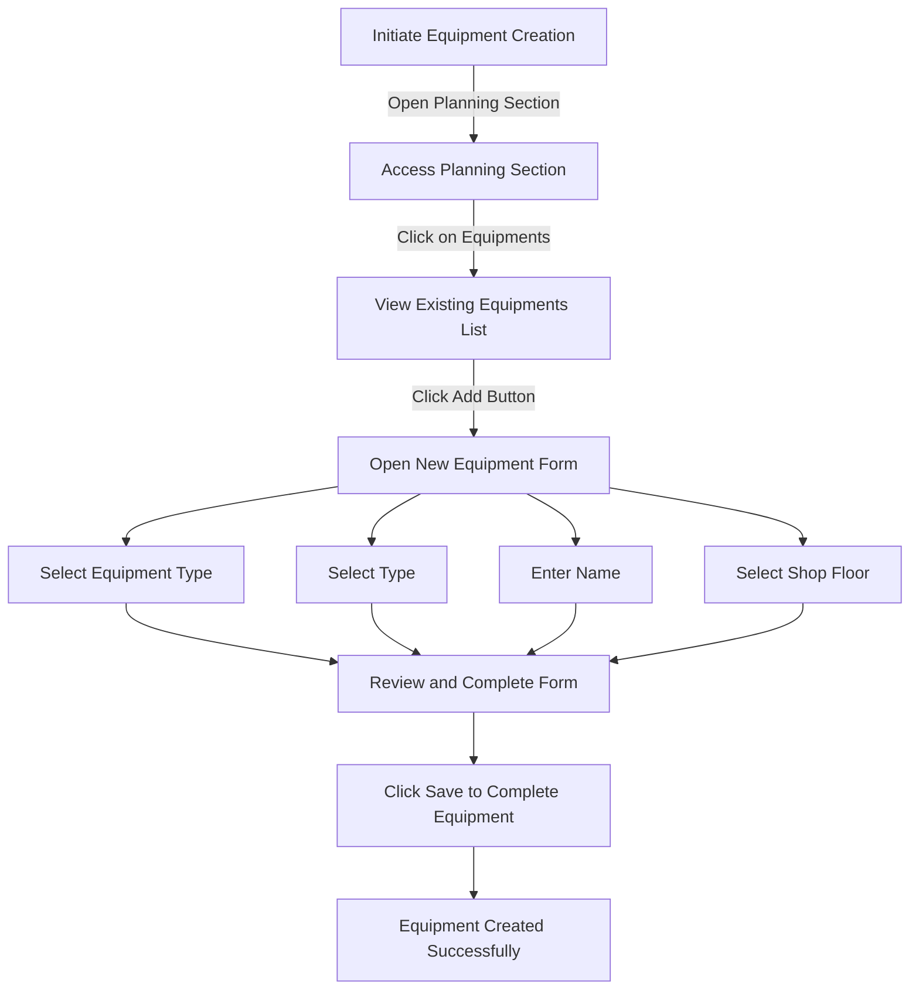

# Equipment in ERPZ

In ERPZ, equipment plays a vital role in the production process, facilitating the efficient execution of various manufacturing operations. From assembly tables to specialized machines like the Mitsubishi paint machine, the right equipment is essential for achieving optimal productivity and quality in manufacturing.

## 1. Significance of Equipment in ERPZ

### 1.1 Increased Efficiency
   - Well-maintained and appropriate equipment streamlines production processes, allowing for faster completion of manufacturing tasks. This efficiency leads to shorter lead times and the ability to meet customer demands promptly.

### 1.2 Improved Product Quality
   - High-quality equipment, such as the Mitsubishi paint machine, contributes to consistent product quality. Reliable equipment minimizes defects and ensures that products meet established standards, which is crucial for customer satisfaction.

### 1.3 Cost Management
   - Investing in the right equipment can lead to significant cost savings in the long run. Efficient machinery reduces labor costs, minimizes waste, and lowers the costs associated with production delays or quality issues.

### 1.4 Enhanced Flexibility
   - Modern equipment often comes with advanced features that allow for quick changes in production setups. This flexibility enables manufacturers to adapt to changing market demands and efficiently handle varying production volumes.

### 1.5 Safety and Compliance
   - Properly maintained equipment enhances workplace safety and helps ensure compliance with industry regulations. This reduces the risk of accidents and contributes to a healthier work environment.

### 1.6 Data Collection and Analysis
   - Many modern production machines are equipped with sensors and software that allow for real-time monitoring of operations. This data can be used for performance analysis, predictive maintenance, and informed decision-making in production planning.

## 2. Flow Chart of Equipment Creation in ERPZ

### 2.1 Equipment Creation Flow Explanation

The process of creating new equipment in ERPZ involves several steps to ensure that all necessary details are captured accurately. Below is an overview of the flow:

1. **Initiate Equipment Creation**: The user begins the process by accessing the planning section of the ERPZ dashboard.
   
2. **Access Planning Section**: The user navigates to the **Planning** section to find the equipment management options.

3. **View Existing Equipment List**: By clicking on the **Equipments** option, the user can view a list of all existing equipment entries.

4. **Open New Equipment Form**: The user then clicks the **Add Button** to open the form for entering details about new equipment.

5. **Fill Out Form Fields**: The user completes the required fields:
   - **Select Equipment Type**: Choose the type of equipment from a dropdown list.
   - **Select Type**: Another type selection from a dropdown.
   - **Enter Name**: Input the name of the equipment in a text field.
   - **Select Shop Floor**: Choose the relevant production floor from a dropdown list.

6. **Review and Complete Form**: After filling out all fields, the user reviews the information for accuracy.

7. **Save Equipment**: Once satisfied with the entries, the user clicks the **Save** button to create the new equipment.

8. **Equipment Created Successfully**: The flow concludes with the successful creation of the new equipment entry, making it available for future production operations.

This structured approach ensures that all critical details about the equipment are captured, facilitating efficient management and operation within ERPZ.

## 3. Viewing Existing Equipment

To view all equipment in ERPZ, follow these steps:

1. **Access the Planning Section**
   - From the dashboard, navigate to the **Planning** section.

2. **Select Equipments**
   - Click on **Equipments**. This will display a list of all existing equipment entries.

   > **Dashboard > Planning > Equipments**

   

## 4. Creating New Equipment

To create a new piece of equipment, perform the following steps:

1. **Open the Equipment List**
   - Ensure you are in the **Equipments** section under the **Planning** menu.

2. **Click the Add Button**
   - Locate and click the **Add** button at the top right corner of the equipment list.

   

3. **Equipment Form** 
   - On clicking **Add** equipment form will open.

   

4. **Fill Out the Equipment Form**
   - Several fields are there in the form to complete:
     - **Equipment Type**: Select the type of equipment from a dropdown list.

     

     - **Type**: Selevt the type from dropdown list.

     
     
     - **Name**: Enter the name of the equipment in the text field.

     

     - **Production Floor**: Choose the relevant production floor from a dropdown list.

     

5. **Save the New Equipment**
   - Once all fields are filled out, click on **Save** to create the new equipment entry.

   

## 4. IF Not Found

If desired option is not available in the searched dropdown for any entity like Equipment Type, Shop Floor etc. then please refer [How to Create An Entity if Not Found](/miscellaneous/create-entity-if-not-found) to understand the process to create one.

## 6. Equipment Form Features and Significance in ERPZ

The Equipment Form in ERPZ includes several key fields that play a vital role in managing production resources effectively. Below are the features of each field and their significance:

### 6.1 Equipment Type (Dropdown List)
- **Feature**: Allows users to select the type of equipment from a predefined list.
- **Significance**: Ensures consistency in categorizing equipment, facilitating better reporting and analysis. This classification aids in tracking equipment usage and maintenance schedules.

### 6.2 Type (Dropdown List)
- **Feature**: Provides an additional classification for the equipment, allowing users to specify its function or purpose.
- **Significance**: Helps in differentiating between similar equipment types and enhances the granularity of inventory management. This field is crucial for operational efficiency and resource allocation.

### 6.3 Equipment Name (Text Field)
- **Feature**: A free text input field where users can enter a specific name for the equipment.
- **Significance**: This field allows for easy identification and referencing of equipment within the system. A clear naming convention aids in reducing confusion and improving communication among team members.

### 6.4 Production Floor (Dropdown List)
- **Feature**: Enables users to select the production floor where the equipment will be utilized.
- **Significance**: This field ensures that equipment is correctly assigned to the relevant production area, enhancing workflow management. It is essential for planning maintenance activities and tracking equipment performance in specific operational contexts.

## 7. Conclusion

In summary, equipment is a cornerstone of production operations in ERPZ. The choice and maintenance of equipment, such as assembly tables and specialized machines, directly impact the efficiency, quality, and flexibility of manufacturing processes. By understanding the significance of equipment, organizations can better plan their production operations, reduce costs, and enhance overall productivity.
