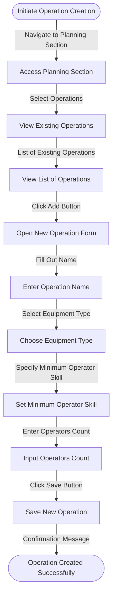

# Operation

An **Operation** in ERPZ refers to any manufacturing activity or task performed on raw materials as part of the production process. Operations play a critical role in transforming raw materials into finished goods.

The **Operation Master** stores details of each manufacturing operation, including its name, description, and the default workstation where the operation is performed.

## 1. Prerequisites

Before creating and using an Operation in ERPZ, ensure that the following is set up:

- **Warehouse**: This defines where the operation will be performed.

## 2. Flow Chart of Operation Creation in ERPZ

### 2.1 Flow Diagram Explanation: Creating a New Operation

The flow diagram outlines the steps to create a new operation in ERPZ:

1. **Initiate Operation Creation**: User decides to create a new operation.
2. **Access Planning Section**: Navigate to the **Planning** section of the ERPZ dashboard.
3. **View Existing Operations**: Select **Operations** to view the list of current operations.
4. **Open New Operation Form**: Click the **Add** button to open the form for a new operation.
5. **Fill Out Name**: Enter a descriptive name for the operation.
6. **Select Equipment Type**: Choose the required equipment type from a dropdown list.
7. **Specify Minimum Operator Skill**: Indicate the minimum skill level for operators.
8. **Enter Operators Count**: Input the number of operators needed for the operation.
9. **Click Save Button**: Click **Save** to record the new operation in the system.
10. **Confirmation Message**: A confirmation message is displayed, indicating successful creation.

This flow illustrates the streamlined process of creating an operation, ensuring all necessary details are captured efficiently.

## 3. Creating an Operation in ERPZ

To create a new operation in ERPZ, follow these steps:

### 3.1 Access the Planning Section
- Navigate to the **Planning** section from the ERPZ dashboard.
- Select **Operations** from the options available.

> **Dashboard > Planning > Operations**

### 3.2 View Existing Operations
- You will see a list of existing operations. This provides an overview of all operations currently recorded in the system.

### 3.3 Start a New Operation
- Click on the **Add** button located at the top right corner of the operations list.

- This action will open a new form for entering operation details.

### 3.4 Complete the Operation Form
Fill in the following fields in the form:
- **Name**: Enter a descriptive name for the operation.

- **Equipment Type**: Specify the type of equipment required for the operation using a dropdown list.

- **Minimum Operator Skill**: Indicate the minimum skill level required for operators.

- **Operators Count**: Enter the number of operators needed for this operation.

### 3.5 Save the New Operation
- After filling in all the necessary fields, click on the **Save** button to create the new operation in the system.

## 4. IF Not Found

If desired option is not available in the searched dropdown for any entity like Warehouse, Equipment Type etc. then please refer [How to Create An Entity if Not Found](/miscellaneous/create-entity-if-not-found) to understand the process to create one.

## 5. Features of the Operation Form

The Operation form in ERPZ is designed to facilitate the creation and management of operations efficiently. Below are the key features associated with each field in the form:

### 5.1 Operation Name
- **Descriptive Input**: Users can enter a meaningful name for the operation, allowing for easy identification and reference in the system.
- **Validation**: The system ensures that the name is unique to prevent duplicates, enhancing organization and clarity.

### 5.2 Equipment Type
- **Dropdown Selection**: A dropdown menu presents users with a list of available equipment types, reducing input errors and ensuring the selection is valid.
- **Dynamic Updates**: The list can be updated based on the equipment available in the organization, reflecting real-time changes.

### 5.3 Minimum Operator Skill
- **Skill Level Specification**: Users can specify the minimum required skill level for operators involved in the operation, ensuring that only qualified personnel are assigned.
- **Pre-defined Skill Levels**: A set of predefined skill levels can be offered to standardize operations and enhance clarity regarding requirements.

### 5.4 Operators Count
- **Numeric Input**: Users can specify the number of operators needed for the operation using a numeric field, allowing for precise staffing requirements.
- **Validation Checks**: The form validates that the entered number is positive, preventing errors in staffing requirements.

### 5.5 Save Functionality
- **Easy Saving**: The **Save** button allows users to create the operation quickly after filling in the necessary fields.
- **Confirmation Message**: Upon successful creation, a confirmation message is displayed, providing reassurance to users that their operation has been recorded.

### 5.6 User-Friendly Interface
- **Intuitive Design**: The layout of the form is designed for ease of use, guiding users through the process of entering information.
- **Tooltips and Help Text**: Additional information can be provided through tooltips or help text next to fields, assisting users in understanding what is required.

## Conclusion
Creating a new operation in ERPZ is a straightforward process that involves navigating to the Planning section, filling out the operation form, and saving your details.The Operation form in ERPZ integrates several features that enhance usability, accuracy, and efficiency. By providing intuitive field management and ensuring the correct input of critical operational data, you can efficiently manage their operations within the ERPZ system.
