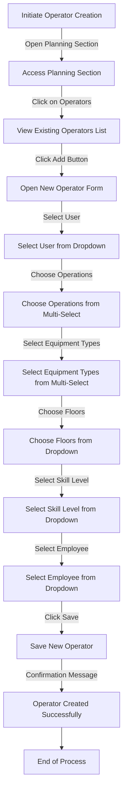

# Operators Section in ERPZ

The **Operators** section in ERPZ is a critical component for managing the workforce involved in various operations. This section displays all the operators created for specific tasks and projects, providing an organized overview of personnel assigned to operations.

## 1. Significance of the Operators Section

1. **Resource Management**: By maintaining a comprehensive list of operators, ERPZ enables efficient management of human resources. It helps supervisors allocate the right personnel to the appropriate operations based on their skills and availability.

2. **Skill Tracking**: The section allows for tracking the skills and qualifications of each operator. This ensures that the right operators are assigned to tasks that match their expertise, enhancing overall operational efficiency.

3. **Performance Monitoring**: The Operators section facilitates the monitoring of operator performance and productivity over time. This information is valuable for assessing workforce effectiveness and identifying areas for improvement.

4. **Streamlined Communication**: With all operator details in one place, communication regarding assignments, schedules, and responsibilities becomes more streamlined, reducing the potential for errors and mismanagement.

5. **Operational Efficiency**: By effectively managing operators, organizations can optimize their operations, reduce downtime, and improve output, contributing to overall business success.

In summary, the Operators in ERPZ is essential for managing human resources effectively, ensuring that operations are staffed appropriately and that personnel are utilized to their full potential.

## 2. Flow Chart of Operator Creation in ERPZ

### 2.1 Flowchart Explanation: Creating a New Operator in ERPZ

The flowchart outlines the process of creating a new operator in ERPZ as follows:

1. **Initiate Operator Creation**: The process begins when the user decides to create a new operator.
2. **Access Planning Section**: The user navigates to the Planning section from the dashboard.
3. **View Existing Operators List**: Within the Planning section, the user clicks on "Operators" to view the list of existing operators.
4. **Open New Operator Form**: The user clicks the "Add" button to open the form for creating a new operator.
5. **Fill Out the Operator Form**: The user fills in various fields in the form:
   - Selects a user from a dropdown.
   - Chooses operations from a multi-select dropdown.
   - Selects equipment types from another multi-select dropdown.
   - Chooses the relevant floors.
   - Selects the skill level of the operator.
   - Chooses the associated employee.
6. **Save New Operator**: After completing the form, the user clicks the "Save" button to create the new operator.
7. **Confirmation Message**: A confirmation message appears, indicating that the operator has been created successfully.
8. **End of Process**: The process concludes once the operator has been created.

This flowchart provides a clear visual representation of the steps involved in the operator creation process, ensuring a smooth and efficient workflow.

## 3. Creating a New Operator in ERPZ

To create a new operator in ERPZ, follow these steps:

1. **Access the Operators Section**:
   - Navigate to the **Planning** section from the ERPZ dashboard.
   - Click on **Operators** to view the list of existing operators.

   > **Dashboard > Planning > Operators**

   

2. **Open New Operator Form**:
   - Click on the **Add** button located at the top-right corner of the operators list.

   

   - A form will open containing the necessary fields for creating a new operator.

   

3. **Fill Out the Operator Form**:
   - **User**: Select from a dropdown list of users.

   

   - **Operations**: Choose operations from a multi-select dropdown list.

   

   - **Equipment Types**: Select the required equipment types from a multi-select dropdown list.

   

   - **Floors**: Choose the relevant floors from a dropdown list.

   

   - **Skill Level**: Select the operator's skill level from a dropdown list.

   

   - **Employee**: Choose the associated employee from a dropdown list.

   

4. **Save the New Operator**:
   - After filling out all the required fields, click the **Save** button to create the new operator.

   

Following these steps will ensure that the new operator is successfully created and added to the system, allowing for efficient management and allocation to operations.

## 5. Features of the Operator Form in ERPZ

The Operator Form in ERPZ is designed to facilitate the creation and management of operators effectively. Below are the key features along with the significance of each field:

1. **User Selection**:
   - **Field Type**: Dropdown List
   - **Significance**: Allows you to assign a specific user to the operator, ensuring clear responsibility and accountability. This is crucial for tracking performance and managing workflows.

2. **Operations Assignment**:
   - **Field Type**: Multi-Select Dropdown
   - **Significance**: Enables the assignment of one or more operations to the operator, ensuring they are aligned with the necessary tasks. This flexibility supports dynamic operational needs and resource management.

3. **Equipment Types**:
   - **Field Type**: Multi-Select Dropdown
   - **Significance**: Specifies the types of equipment the operator is qualified to use. This is vital for safety and compliance, ensuring operators are matched with appropriate machinery.

4. **Floors Selection**:
   - **Field Type**: Dropdown List
   - **Significance**: Identifies the specific operational areas (floors) where the operator will be working. This helps in organizing workflow and optimizing resource allocation across different locations.

5. **Skill Level**:
   - **Field Type**: Dropdown List
   - **Significance**: Categorizes operators based on their expertise. Understanding skill levels aids in effective task assignments and helps identify training needs for workforce development.

6. **Employee Association**:
   - **Field Type**: Dropdown List
   - **Significance**: Links the operator to a specific employee record. This connection enhances personnel tracking and management, ensuring seamless integration into the organizational structure.

7. **Save Functionality**:
   - **Field Type**: Button
   - **Significance**: The "Save" button allows users to submit the information, creating a new operator entry in the system. This functionality is essential for data integrity and record management.

8. **User-Friendly Interface**:
   - **Field Type**: Overall Design
   - **Significance**: The form’s intuitive design makes it easy to navigate, ensuring users can efficiently complete the operator creation process. A user-friendly interface enhances productivity and reduces training time.

These features and their significance ensure that the operator form in ERPZ effectively supports operational management, contributing to better organization, safety, and efficiency within the workforce.

## 6. Conclusion

In ERPZ, the Operators section plays a critical role in streamlining operations and enhancing overall productivity. By efficiently managing operator details, including their skills, assigned tasks, and equipment qualifications, organizations can ensure that the right personnel are matched with the appropriate roles. 

The ability to create and manage operators through an intuitive form facilitates quick adaptations to changing operational needs, promotes accountability, and enhances safety standards. As organizations strive for optimal efficiency, the effective use of the Operators section in ERPZ is essential for achieving operational excellence and driving growth. 

Ultimately, a well-structured operator management system not only improves day-to-day operations but also contributes to long-term success by ensuring that the workforce is skilled, well-coordinated, and aligned with the organization's objectives.

