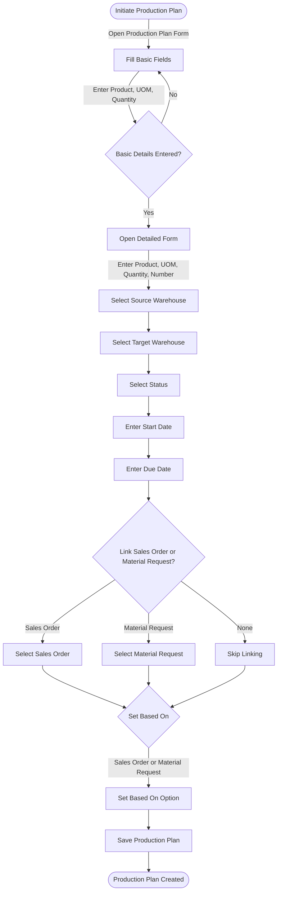

# Production Plan

A Production Plan assists in production and material planning for items designated for manufacturing. These production items can be committed via **Sales Orders** (to customers) or **Material Requests** (internally).

The Production Plan helps users plan production against multiple Sales Orders or Material Requests. Additionally, it aids in material procurement planning for raw materials based on the quantities of finished products to be manufactured.

## 1. Prerequisites

Before creating and utilizing a Production Plan, ensure you have created the following:

- Item
- Material Request
- Sales Order
- Bill of Materials

## 2. Flow Chart of Production Plan Creation in ERPZ

### 2.1 Flowchart Explanation

1. **Initiate Production Plan**: Start by opening the Production Plan form.
2. **Basic Fields**: Complete the mandatory basic fields (Product, UOM, Quantity).
3. **Detailed Form**: Fill out detailed fields, including warehouses, status, and dates.
4. **Linking Options**: Link a Sales Order or Material Request if applicable, or skip if not needed.
5. **Based On**: Set the `Based On` field to define if the plan is based on a Sales Order or Material Request.
6. **Save**: Save the completed Production Plan.

This flowchart organizes each step, helping users visualize the sequence for creating a Production Plan.

## 3. Production Plan Creation

To create a Production Plan in ERPZ, follow these steps:

### 3.1 Access the Production Plan Section
1. Navigate to the **Planning** section from the **Dashboard** and then click on **Production Plan**.
2. Inside the **Production Plan** section, you’ll see a list of existing production plans.

> **Dashboard > Planning > Production Plans**

### 3.2 Create a New Production Plan
1. Click on the **Add** button located at the top right corner of the list to start a new production plan.

2. A popup will appear containing the following mandatory fields:

   - **Product**: Select the product from a dropdown list.

   

   - **UOM (Unit of Measure)**: Choose the unit of measure from a dropdown list.

   

   - **Quantity**: Enter the quantity needed for the production plan.

   

3. After filling in these fields, you can:
   - Click on **Save** to create a new production plan with basic details.
   - Or, click on **Add All Production Plan Details** to open a detailed form for more options.

   

### 3.3 Fill Out the Detailed Production Plan Form
If you clicked on **Add All Production Plan Details**, a detailed form will appear with additional fields:

### 3.4 Detailed Form Fields
1. **Product** (Dropdown, mandatory): Select the product for the plan.

2. **UOM** (Dropdown, mandatory): Choose the unit of measure.

3. **Quantity** (Mandatory): Enter the quantity required.

4. **Number**: This field is autogenerated when the production plan is saved.
5. **Source Warehouse** (Dropdown): Select the warehouse supplying the materials.

6. **Target Warehouse** (Dropdown): Choose the warehouse where the finished product will be stored.

7. **Status** (Dropdown): Set the status of the production plan (e.g., Draft, Confirmed).

8. **Start Date** and **Due Date**: Specify the dates for production start and completion.

9. **Sales Order** (Dropdown): Link a sales order if applicable.

10. **Material Request** (Dropdown): Link a material request if applicable.

11. **Based On** (Dropdown): Choose one of the following options:
    - **Sales Order**: Plan production based on a sales order.
    - **Material Request**: Plan production based on a material request.

    

### 3.5 Save the Production Plan
After filling in all required and optional fields in the detailed form:
1. Click **Save** to create the new production plan with all specified details.

## 4. IF Not Found

If desired option is not available in the searched dropdown for any entity like Source Warehouse, Target Warehouse etc. then please refer [How to Create An Entity if Not Found](/miscellaneous/create-entity-if-not-found) to understand the process to create one.

## 5. Enhanced Features for Production Plan

The following features can improve the functionality of the Production Plan form in ERPZ by leveraging existing fields:

### 5.1 Auto-Stock Check for Source Warehouse
   - **Feature**: Automatically check stock availability in the **Source Warehouse** when a product and quantity are selected.
   - **Description**: This feature will notify users if sufficient stock is available or if additional material requests are needed, streamlining inventory planning.

### 5.2 Real-Time Progress Tracking
   - **Feature**: Track and display the status of production in real-time, based on the **Status** field.
   - **Description**: Provide automatic updates on production stages (e.g., Draft, Confirmed), improving workflow transparency and production oversight.

### 5.3 Due Date Validation
   - **Feature**: Validate **Due Date** against **Start Date** and highlight conflicts.
   - **Description**: Prevent accidental scheduling conflicts by ensuring that the Due Date is always later than the Start Date, helping avoid timeline issues in production.

### 5.4 Production Volume Adjustment
   - **Feature**: Enable adjustments to the **Quantity** based on available resources and production capacity.
   - **Description**: If stock or resource constraints affect the initial quantity, this feature will provide options to adjust the quantity before confirming the Production Plan.

### 5.5 Linked Sales Order & Material Request Overview
   - **Feature**: Provide a summary view of linked **Sales Orders** or **Material Requests** within the form.
   - **Description**: Display key details of any linked sales order or material request, offering a quick reference for production requirements tied to sales or inventory needs.

### 5.6 Automated Number Generation for Tracking
   - **Feature**: Autogenerate and assign a unique **Number** for each new Production Plan entry.
   - **Description**: A unique number aids in tracking and referencing individual plans, making it easy to identify production plans within the system.

### 5.7 Timeline View for Production Schedules
   - **Feature**: Display a timeline or calendar view based on the **Start Date** and **Due Date**.
   - **Description**: Provides a visual representation of production schedules, making it easier for teams to track timelines and identify overlapping plans.

### 5.8 Suggested Warehouses Based on Product
   - **Feature**: Suggest **Source Warehouse** and **Target Warehouse** options based on historical data for each selected product.
   - **Description**: This feature simplifies warehouse selection by presenting likely warehouse choices based on past production plans, improving selection efficiency.

## Conclusion
Following these steps allows you to create a production plan in ERPZ, either with basic or detailed information. This flexibility helps streamline production scheduling, inventory planning, and resource allocation.