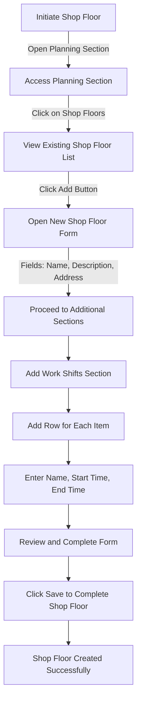

# Shop Floors in ERPZ

In ERPZ, the shop floor represents the physical area where production activities take place. It is a critical component of the manufacturing environment, providing a structured space where machinery, labor, and materials converge to complete production tasks. Proper management of shop floors within ERPZ enables a streamlined production process and supports efficient operations.

## 1. Significance of Shop Floors in ERPZ

1. **Production Planning**: By designating specific areas for production activities, ERPZ facilitates precise production scheduling, resource allocation, and real-time tracking of tasks across different shop floors.

2. **Resource Management**: Shop floors help in organizing machinery, tools, and labor according to production needs. By defining these areas, ERPZ enables effective tracking and allocation of resources, reducing bottlenecks and maximizing productivity.

3. **Enhanced Workflow Visibility**: Through shop floor management, ERPZ provides insights into the status of each area within the production facility. This visibility helps production managers monitor processes, identify delays, and make informed adjustments.

4. **Safety and Compliance**: Clear demarcation of shop floors ensures that safety protocols are followed and that compliance standards are met. ERPZ’s shop floor management feature allows companies to document and enforce safety measures in designated production areas.

5. **Cost Efficiency**: Organized shop floors contribute to reducing production downtime, optimizing resource usage, and managing costs effectively. ERPZ's ability to monitor and manage activities by shop floor enhances cost-efficiency by minimizing waste and improving output quality.

## 2. Flow Chart of Shop Floor Creation in ERPZ

### 2.1 Shop Floor Creation Flow Explanation

This flowchart outlines the process of creating a new shop floor in ERPZ, starting from navigation to final form submission:

1. **Initiate Shop Floor**: Begin by accessing the Planning section.
2. **Access Shop Floor Section**: Click on "Shop Floors" in the Planning section to view the list of existing shop floors.
3. **Open New Shop Floor Form**: Click the "Add" button to initiate a new shop floor creation form.
4. **Form Completion**:
    - **Basic Details**: Enter essential information, including the name, description, and address of the shop floor.
5. **Work Shifts Section**:
    - **Add Work Shifts**: In the Work Shifts section, click "Add Row" for each shift.
    - **Work Shift Details**: For each shift, specify the name, start time, and end time.
6. **Review and Save**: After completing all fields, review the information, then click "Save" to create the shop floor.
7. **Completion**: The new shop floor is successfully created and added to the list.

This structured approach ensures that each shop floor in ERPZ is defined with all necessary details, including its operating shifts, enhancing operational organization and scheduling.

## 3. Creating a New Shop Floor in ERPZ

To manage production efficiently, ERPZ allows you to create and configure shop floors with specific details and work shifts. Follow these steps to create a new shop floor in ERPZ:

### 3.1 Accessing the Shop Floor Section

1. **Navigate to Planning**: Go to the Planning section from the dashboard.
2. **Select Shop Floor**: Click on "Shop Floor" to view the list of existing shop floors.

**Shop Floor Navigation**:
> **Dashboard > Planning > Shop Floors**

3. **Add a New Shop Floor**: To create a new shop floor, click the "Add" button located at the top right of the list.

### 3.2 Shop Floor Details Form

Upon clicking "Add," a detailed form will open, containing the following fields:

- **Name**: Enter the name of the shop floor in the text field.

- **Description**: Provide a description of the shop floor in the text field to specify its purpose or location details.

- **Address**: Use the search bar to locate the desired address. A dropdown with relevant address options will appear, or you can click the map icon on the right to add an address manually.

### 3.3 Work Shifts Section

In the Work Shifts section, you can define the working hours for this shop floor:

1. **Add Work Shifts**: Click on "Add Row" to create a new work shift.

2. **Work Shift Details**:
    - **Name**: Specify the shift name in the text field.

    

    - **Start Time**: Enter the start time in HH:MM format.

    

    - **End Time**: Enter the end time in HH:MM format.

    

3. **Multiple Shifts**: You can add multiple shifts as required by repeating the "Add More" process.

### 3.4 Saving the Shop Floor

After filling out all fields and adding the necessary shifts:
- Click on **Save** to create the new shop floor.

## 4. Shop Floor Form Features

The **Shop Floor Form** in ERPZ allows users to define and manage various shop floors effectively. This form captures essential details to establish organized workspaces, align resources, and optimize production schedules. Key features of the form include:

1. **Dynamic Address Selection**: Search and select existing addresses or add new ones with the map icon feature, making it easy to locate or update shop floor addresses.
2. **Flexible Work Shifts Section**: Add multiple work shifts with start and end times, ensuring the setup of varied operational hours as per shop floor requirements.
3. **Review and Save Options**: Allows thorough review of entered data before saving, ensuring accurate and complete shop floor creation.

## 5. Field Significance

### 5.1 Name (Text Field)
   - **Purpose**: Identifies the shop floor uniquely within the ERPZ system.
   - **Significance**: A clear and recognizable name helps users easily locate and refer to the shop floor in the system, improving organization and accessibility.

### 5.2 Description (Text Field)
   - **Purpose**: Provides a detailed description of the shop floor.
   - **Significance**: Allows documentation of key characteristics or instructions for each shop floor, which is useful for team members and administrators overseeing multiple production areas.

### 5.3 Address (Search Bar with Map Icon)
   - **Purpose**: Identifies the shop floor's location.
   - **Significance**: Selecting a location or adding a new one through the map icon ensures accurate address information, which is crucial for logistics, deliveries, and setting location-specific production parameters.

### 5.4 Work Shifts Section
   - **Purpose**: Defines operational hours for the shop floor.
   - **Fields**:
       - **Name** (Text Field): Names the shift for easy identification.
       - **Start Time** (HH:MM): Sets the beginning of the shift.
       - **End Time** (HH:MM): Marks the end of the shift.
   - **Significance**: Setting defined shifts helps allocate workforce and machinery resources efficiently across different operational hours, supports production scheduling, and ensures continuous workflow on the shop floor.

Each of these fields collectively contributes to a structured setup and management of shop floors, enabling efficient planning and use of resources in ERPZ.

## 6. Conclusion

Shop floors in ERPZ play a vital role in maintaining an organized, efficient, and safe production environment. By segmenting production areas within ERPZ, businesses can enhance visibility, improve resource management, and ensure smoother production operations that align with organizational goals.
