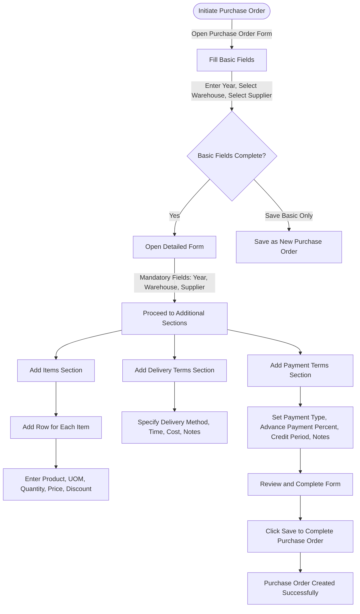

# Purchase Order

A Purchase Order is a binding contract with your Supplier that you promise to buy a set of items under given conditions.

It is similar to a Sales Order but instead of sending it to an external party, you keep it for internal records.

## 1. Prerequisites

Before creating and using a Purchase Order, it is advised that you create the following first:

- Supplier
- Item

## 2. Flow Chart of Purchase Order Creation in ERPZ

### 2.1 Flow Explanation

1. **Initiate Purchase Order**  
   The process begins by opening the Purchase Order form.

2. **Basic Form Completion**  
   Users fill out the basic fields (Year, Warehouse, Supplier). They can either:
   - Save the form with these basic details, creating a minimal Purchase Order.
   - Or proceed to fill out more detailed sections.

3. **Detailed Form Completion**  
   After completing the basic fields, the user moves to additional sections for further customization.

4. **Items Section**  
   Users add items to the order, specifying each item's product, UOM, quantity, price, and discount.

5. **Delivery Terms Section**  
   Users specify delivery terms, including the delivery method, time, and any additional costs or notes.

6. **Payment Terms Section**  
   Users set the payment terms, choosing the payment type, advance payment percentage, credit period, and any additional notes.

7. **Finalize and Save**  
   After reviewing the entire form, the user saves the Purchase Order, marking it as successfully created.

## 3. Creating a Purchase Order in ERPZ

In ERPZ, creating a Purchase Order (PO) is a straightforward process. The Purchase Order form is accessible from the Procurement section of the dashboard, where you can view, add, and manage purchase orders.

### 3.1 Access the Purchase Order List
   - Go to the **Procurement** section on the ERPZ dashboard.
   - Select **Purchase Order** to open the list of existing purchase orders.

   > **Dashboard > Procurement > Purchase Order**

   

### 3.2 Start a New Purchase Order
   - Click on the **Add** button at the top-right corner of the purchase orders list.
   - A popup form will open with basic fields to initiate a new Purchase Order.

   

   ---

   

### 3.3 Complete the Basic Form Fields
   - **Year**: Defaults to the current year.
   - **Warehouse**: Select from a dropdown list.

   

   - **Supplier**: Choose a supplier from a dropdown list.

   

   Once these fields are selected, you have two options:
   - Click on **Save** to create a new Purchase Order with only basic details.
   - Or, click on **Add All Purchase Order Details** to expand the form with additional fields for further customization.

   

   ---

   

### 3.4 Detailed Purchase Order Form Fields

Once you open the detailed form, you can see additional fields for more comprehensive Purchase Order creation. Complete the following fields:

- **Year**: Defaults to the current year.
- **Warehouse**: Choose from a dropdown list.

- **Supplier**: Select from a dropdown list. 

  (Note: These three fields are mandatory)
  
- **Number**: Auto-generated after saving.
- **Recurring**: Checkbox for recurring orders, default unchecked.
- **Date**: Set the date of the order.
- **Expiry Date**: Specify an expiry date if applicable.

- **Sub Total**: Enter the subtotal of all items.

- **Tax Total**: Specify the tax total of all items.

- **Total**: Calculates automatically based on subtotal and tax.

- **Discount**: Enter any discounts on the total.

- **Status**: Choose the order status from a dropdown list.

- **Terms and Conditions**: Enter any special terms or conditions in the text field.

### 3.5 Additional Sections

Below the main form, there are three sections for **Items**, **Delivery Terms**, and **Payment Terms**.

#### 3.5.1 Items
   - Click on **Add Row** to add items to the purchase order.

   

   - Fill in the following fields for each item:
      - **Product**: Select from a dropdown list.

      
   
      - **UOM** (Unit of Measure): Choose the unit of measure.

      
   
      - **Quantity**: Enter the quantity of the item.

      
   
      - **Price**: Specify the unit price.

      
   
      - **Discount**: Enter any discount applicable to the item.

      

#### 3.5.2 Delivery Terms
   - **Delivery Method**: Specify the delivery method.

   

   - **Delivery Time (in days)**: Enter the expected delivery time.

   

   - **Delivery Cost**: Specify the delivery cost.

   

   - **Notes**: Add any notes or instructions regarding delivery.

   

#### 3.5.3 Payment Terms
   - **Payment Type**: Select from three options: Advance Payment, Payment on Delivery, or Credit.

   

   - **Advance Payment Percent**: If applicable, enter the advance payment percentage.

   

   - **Credit in Days**: Specify the credit period in days.

   

   - **Notes**: Add any additional payment-related notes.

   

### 3.6 Save the Purchase Order
   - After filling out all relevant fields in the form and sections, click on **Save** to create the new Purchase Order in ERPZ.

## 4. IF Not Found

If desired option is not available in the searched dropdown for any entity like Source Warehouse, Target Warehouse etc. then please refer [How to Create An Entity if Not Found](/miscellaneous/create-entity-if-not-found) to understand the process to create one.

## 5. Features of the Purchase Order Form

The Purchase Order form in ERPZ is designed to facilitate a seamless ordering process. Below are the key features associated with each field in the form:

### 5.1 Basic Fields

#### Year
- **Default Value**: Automatically populates with the current year, reducing the need for manual input.
- **Validation**: Ensures that the year entered is valid and within an acceptable range.

#### Warehouse
- **Dropdown Selection**: Users can easily select from a list of available warehouses, minimizing entry errors.
- **Dynamic Updates**: The list can be updated in real-time to reflect any changes in warehouse availability.

#### Supplier
- **Supplier List**: A dropdown menu provides a list of registered suppliers, ensuring users select valid suppliers.
- **Search Functionality**: Allows users to search for suppliers by name, streamlining the selection process.

### 5.2 Detailed Fields

#### Number
- **Auto-Generated**: Once the Purchase Order is saved, the system automatically generates a unique Purchase Order number for tracking.
- **Read-Only Field**: This field is displayed as read-only after generation to prevent accidental changes.

#### Recurring
- **Checkbox Feature**: Users can easily mark the order as recurring, simplifying the management of regular purchases.

#### Date and Expiry Date
- **Date Pickers**: Intuitive date pickers for selecting order and expiry dates to minimize input errors.
- **Validation**: Ensures the expiry date is later than the order date.

#### Sub Total, Tax, and Total
- **Automatic Calculations**: The form calculates the subtotal, tax, and total automatically based on item entries, reducing manual calculations.
- **Editable Fields**: Users can modify the tax and discount values to suit specific order requirements.

#### Discount
- **Percentage or Fixed Amount**: Users can specify discounts as either a percentage or a fixed amount, providing flexibility in pricing.

#### Status
- **Dropdown Menu**: Allows users to select the status of the Purchase Order, helping track the order's progress.

#### Terms and Conditions
- **Text Area**: Users can enter special terms or conditions, ensuring that all relevant information is communicated.

### 5.3 Additional Sections

#### Items Section
- **Dynamic Item Addition**: Users can add multiple items to the order, with each item having fields for product selection, unit of measure (UOM), quantity, price, and discounts.
- **Real-time Totals**: The form updates the total amount as items are added or modified, providing instant feedback on the order value.

#### Delivery Terms
- **Delivery Method Selection**: Users can specify how the order will be delivered, ensuring clarity in logistics.
- **Delivery Cost and Notes**: Fields to capture delivery costs and additional instructions enhance communication with suppliers.

#### Payment Terms
- **Payment Type Options**: Users can select from various payment types, including Advance Payment, Payment on Delivery, or Credit.
- **Advance Payment Percentage**: If applicable, users can specify the percentage of advance payment required, facilitating better cash flow management.

### 5.4 Save and Confirmation
- **Save Functionality**: A prominent save button allows users to finalize the Purchase Order easily.
- **Confirmation Message**: Users receive a confirmation message once the Purchase Order is successfully created, enhancing user experience and reducing uncertainty.

## Conclusion

The Purchase Order form in ERPZ allows you to efficiently create orders with various options, including item specifications, delivery details, and payment terms. Following these steps and completing each field ensures accurate and streamlined order management within the ERPZ system.

