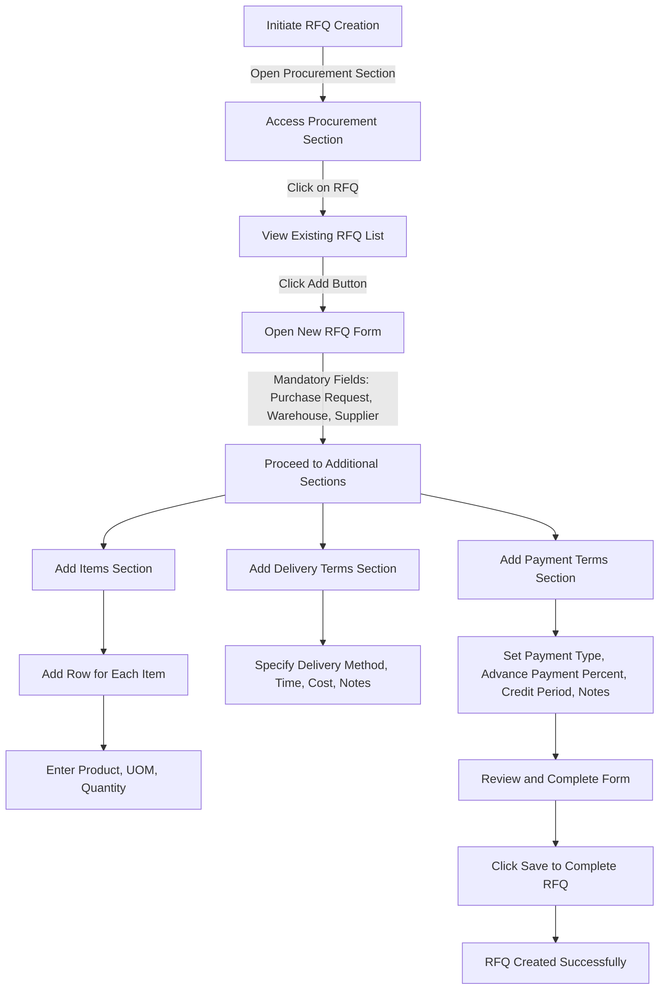

# Request for Quotation (RFQ)

A **Request for Quotation (RFQ)** in ERPZ is a formal process where a company invites suppliers to submit price quotes for specific products or services. The RFQ is a key step in procurement, allowing businesses to compare offerings, negotiate terms, and ensure cost-effectiveness.

## 1. Significance in ERPZ

1. **Cost Efficiency**: By collecting and comparing quotes from multiple suppliers, businesses can choose the most cost-effective option, helping reduce procurement costs.
2. **Supplier Management**: RFQs streamline supplier communication, creating a clear record of terms, pricing, and specifications, which aids in relationship management and accountability.
3. **Transparency & Compliance**: Standardizing RFQs in ERPZ ensures procurement transparency, which is especially important for audit trails and regulatory compliance.
4. **Decision Support**: RFQs enable better purchasing decisions by presenting all relevant supplier data in a centralized system, helping the team make informed choices.

In ERPZ, an RFQ can be linked to the entire supply chain, affecting inventory, purchase orders, and ultimately the production flow.

## 2. Flow Chart of Request for Quotation (RFQ) Creation in ERPZ

### 2.1 RFQ Creation Process Flowchart Explanation

This flowchart outlines the process for creating a new Request for Quotation (RFQ) within the procurement system. Below is a step-by-step explanation of each stage:

1. **Initiate RFQ Creation**: The process begins with the user initiating the RFQ creation.

2. **Access Procurement Section**: The user navigates to the Procurement section of the dashboard.

3. **View Existing RFQ List**: By clicking on RFQ, the user can view a list of existing RFQs.

4. **Open New RFQ Form**: The user clicks the "Add" button to open a new RFQ form.

5. **Complete Mandatory Fields**: The user must fill in the mandatory fields, including Purchase Request, Warehouse, and Supplier, before proceeding to additional sections.

6. **Add Items Section**: The user can add items to the RFQ by accessing the Items section. For each item, they will click "Add Row" to enter the product details, including Unit of Measure (UOM) and Quantity.

7. **Add Delivery Terms Section**: In this section, the user specifies the delivery terms, including the Delivery Method, Delivery Time, Delivery Cost, and any additional Notes.

8. **Add Payment Terms Section**: The user sets the Payment Terms, which include selecting the Payment Type, entering the Advance Payment Percentage, specifying the Credit Period, and adding any relevant Notes.

9. **Review and Complete Form**: After filling out all sections, the user reviews the form to ensure all information is accurate and complete.

10. **Click Save to Complete RFQ**: Finally, the user clicks the "Save" button to create the RFQ successfully.

11. **RFQ Created Successfully**: The process concludes with the confirmation that the RFQ has been created successfully.

This structured flow ensures that all necessary information is collected for a comprehensive RFQ while guiding the user through each step of the process.

## 3. Creating a Request for Quotation (RFQ) in ERPZ

To create an RFQ in ERPZ, follow these steps:

### 3.1 Access the Procurement Section: 
   - Navigate to the **Procurement** section from the dashboard.
   - Click on **RFQ** to view a list of existing RFQs.

   > **Dashboard > Procurement > RFQ**

   

### 3.2 Initiate a New RFQ:
   - To create a new RFQ, click on the **Add** button located at the top right corner of the RFQ list.

   

   - This action will open a form with multiple sections where you'll enter RFQ details.

   

#### 3.2.1 General Section
   - **Number**: Auto-generated RFQ number.
   - **Purchase Request**: A dropdown list for selecting the associated purchase request.
  
   

   - **Suppliers**: A dropdown list to choose suppliers.

   

   - **Warehouse**: A dropdown list to select the warehouse.

   

   - **Requested Date**: Date when the RFQ was created.
   - **Requested Deadline**: Deadline by which responses are needed.

   

   - **Status**: A dropdown list for selecting the current status of the RFQ.

#### 3.2.2 Items Section
   - Click on **Add Row** to include an item. This action opens a form with the following fields:

   

     - **Product**: A dropdown list to select the product.

     

     - **Quantity (Qty)**: Specify the quantity required.

     

     - **Unit of Measure (UOM)**: A dropdown list for the unit of measurement.

     

#### 3.2.3 Delivery Terms Section
   - **Delivery Method**: Specify the delivery method.

   

   - **Delivery Time (Days)**: Enter the estimated delivery time in days.

   

   - **Delivery Cost**: Specify the delivery cost.

   - **Notes**: Add any notes related to delivery.

   

#### 3.2.4 Payment Terms Section
   - **Payment Type**: A dropdown list to select the type of payment.

   

   - **Advance Payment (%)**: Specify the advance payment percentage, if any.

   

   - **Credit Time (Days)**: Define the credit period in days.
   - **Notes**: Add any payment-related notes.

   

### 3.3 Save the RFQ:
   - After filling out all required fields, click on the **Save** button to create the new RFQ.

   

Following these steps will create a new RFQ in ERPZ, allowing you to streamline the procurement process and request quotes from suppliers efficiently.

## 4. IF Not Found

If desired option is not available in the searched dropdown for any entity like Warehouse, Purchase Request etc. then please refer [How to Create An Entity if Not Found](/miscellaneous/create-entity-if-not-found) to understand the process to create one.

## 5. RFQ Form Features and Significance

The Request for Quotation (RFQ) form is essential for facilitating effective procurement processes. Below are the key features of the RFQ form along with the significance of each field:

### 5.1 Features of the RFQ Form

#### 1. User-Friendly Interface
   - The form provides a clear and intuitive layout, guiding users through the RFQ creation process with structured sections.

#### 2. Auto-Generated Purchase Request Number
   - Ensures that each RFQ is uniquely identifiable, helping in tracking and referencing specific requests.

#### 3. Dropdown Selections for Key Fields
   - **Supplier, Warehouse, and Payment Type**: These fields allow users to select from predefined options, ensuring consistency and reducing the likelihood of errors.

#### 4. Dynamic Item Addition
   - Users can easily add multiple products by clicking "Add Row," enabling flexibility to accommodate various items within a single RFQ.

#### 5. Detailed Item Information
   - Allows for specific details to be captured for each item:
     - **Product**: Selection from a dropdown ensures accurate identification of items.
     - **Quantity**: Numeric input to specify the required amount.
     - **Unit of Measure (UOM)**: Ensures clarity in measurement standards.

#### 6. Comprehensive Delivery Terms Section
   - Captures all necessary delivery details, including:
     - **Delivery Method**: Helps to define how the items will be transported.
     - **Delivery Time**: Indicates the expected timeframe for delivery.
     - **Delivery Cost**: Essential for budget planning and cost management.
     - **Notes**: Allows for additional instructions or clarifications.

#### 7. Flexible Payment Terms Section
   - Facilitates negotiation and clarity in payment arrangements:
     - **Advance Payment Percentage**: Defines upfront payment expectations.
     - **Credit Time**: Specifies the credit period allowed for payments.
     - **Notes**: Provides space for any additional remarks regarding payment.

#### 8. Validation Checks
   - Ensures that all mandatory fields are filled out, reducing errors and incomplete submissions.

#### 9. Save and Review Functionality
   - Allows users to save their progress and review the RFQ before final submission, ensuring accuracy.

#### 10. Confirmation of RFQ Creation
   - Provides users with a confirmation message upon successful RFQ creation, ensuring transparency in the process.

### 5.2 Significance of the RFQ Form Fields

#### 1. General Section Fields
- **Purchase Request Number**: Essential for tracking and managing RFQs effectively.
- **Supplier**: Critical for identifying potential vendors and ensuring that procurement decisions align with company policies.
- **Warehouse**: Helps in managing inventory and logistics by linking the RFQ to specific storage locations.

#### 2. Items Section Fields
- **Product**: Accurate identification of items is vital for procurement accuracy and order fulfillment.
- **Quantity**: Necessary for calculating total costs and managing stock levels.
- **Unit of Measure (UOM)**: Ensures clarity in the quantity being requested, preventing misunderstandings.

#### 3. Delivery Terms Fields
- **Delivery Method**: Important for planning logistics and selecting appropriate transportation.
- **Delivery Time**: Helps in aligning procurement schedules with project timelines.
- **Delivery Cost**: Critical for budget management and evaluating the overall cost-effectiveness of the RFQ.
- **Notes**: Provides a space for specific instructions that may affect delivery.

#### 4. Payment Terms Fields
- **Payment Type**: Clarifies the payment structure, which is essential for financial planning.
- **Advance Payment Percentage**: Defines upfront financial commitments, impacting cash flow management.
- **Credit Time**: Important for negotiating favorable payment terms with suppliers.
- **Notes**: Allows for additional clarifications, ensuring all parties have a shared understanding of terms.

These features and field significances enhance the efficiency and effectiveness of the RFQ process, enabling better procurement management and supplier relations.

## 6. Conclusion

The Request for Quotation (RFQ) process is a critical component of effective procurement management within ERPZ. By utilizing a well-structured RFQ form, organizations can streamline their purchasing procedures, enhance supplier interactions, and ensure clarity in procurement terms.

The comprehensive fields within the RFQ form allow users to capture essential details, from general information to specific item and payment terms. This structured approach minimizes errors, facilitates better decision-making, and helps organizations manage their procurement activities efficiently. 

Ultimately, a robust RFQ process contributes to better cost control, improved supplier relationships, and successful project execution, aligning with ERPZ's goal of optimizing business operations and driving growth.
