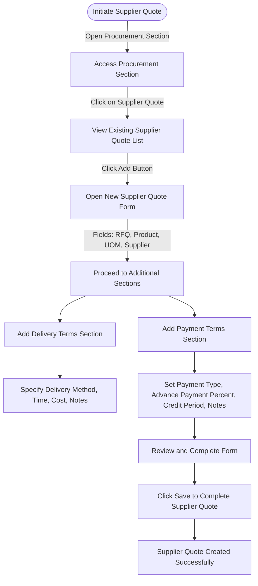

# Supplier Quote

## Overview
A **Supplier Quote** in ERPZ is a document submitted by a supplier detailing the pricing and terms for goods or services offered to a business. It serves as an initial response to a request for quotation (RFQ) issued by the business, outlining specific details such as item prices, quantities, lead times, and other terms of supply. This document provides a foundation for negotiation and comparison across different suppliers, helping a business make an informed purchasing decision.

## 1. Significance
The Supplier Quote feature is a crucial part of ERPZ's procurement module, offering several key benefits:

- **Cost Optimization:** By comparing quotes from multiple suppliers, businesses can choose the most cost-effective options.
- **Transparency and Accountability:** Storing all supplier quotes in a centralized system ensures transparency in the procurement process, providing a clear record of price offerings.
- **Efficient Supplier Management:** Quotes allow businesses to track supplier reliability and responsiveness, which is useful for long-term supplier relationships.
- **Decision Support:** With detailed information on pricing, lead times, and terms, businesses can make well-informed decisions based on their procurement priorities.

The Supplier Quote feature integrates with other ERPZ modules such as Purchase Orders and Inventory Management, making it a vital part of an efficient procurement workflow.

## 2. Flow Chart of Supplier Quote Creation in ERPZ

### 2.1 Supplier Quote Creation Flow

#### 2.1.1 Flow Overview
This flow outlines the steps to create a new Supplier Quote in ERPZ, from accessing the Supplier Quote section to saving the completed quote.

1. **Initiate Supplier Quote**  
   Begin by accessing the **Supplier Quote** section in ERPZ.

2. **Access Supplier Quote Section**  
   Open the Supplier Quote section, then click on **Supplier Quote** to view the list of existing quotes.

3. **Open New Supplier Quote Form**  
   Click on the **Add** button to open a new form for creating a Supplier Quote.

4. **Fill Out Supplier Details**  
   Complete key fields such as **RFQ**, **Product**, **UOM**, and **Supplier**.

5. **Add Delivery Terms**  
   In the **Delivery Terms** section, specify details like the delivery method, time in days, cost, and any additional notes.

6. **Add Payment Terms**  
   In the **Payment Terms** section, choose the payment type, set the advance payment percentage, define the credit period in days, and add relevant notes.

7. **Review and Save**  
   Review all entered details, then click **Save** to finalize and create the Supplier Quote.

#### 2.1.2 Completion
Upon saving, the new Supplier Quote is successfully created and stored in the ERPZ system.

## 3. How to Create a Supplier Quote in ERPZ

1. **Navigate to the Procurement Section** 
   Go to the **Procurement** section in ERPZ. Here, you’ll find the **Supplier Quote** option. Click on it to view a list of existing supplier quotes.

   > **Dashboard > Procurement > Supplier Quote**

   

2. **Adding a New Supplier Quote** 
   To add a new Supplier Quote, click on the **Add** button located at the top-right corner of the list. This will open a form for creating a new Supplier Quote.

   

   ---

   

3. **Filling Out the Supplier Quote Form** 
   The form consists of several fields, each designed to capture essential details of the quote:

   - **Supplier**: Select the supplier from the dropdown list.

   

   - **RFQ**: Choose the relevant Request for Quotation (RFQ) from the dropdown list.

   

   - **Valid Till**: Set the expiration date of the quote.

   

   - **Product**: Select the product for which the quote is being created.

   

   - **UOM (Unit of Measure)**: Choose the appropriate unit of measurement for the product.

   

   - **MOQ (Minimum Order Quantity)**: Specify the minimum quantity that can be ordered.

   

   - **Price**: Enter the price offered by the supplier.

   

   - **Tax**: Select the applicable tax from the dropdown list.

   

   - **Capacity**: Indicate the production capacity.

   

   - **Capacity in Time**: Specify the time duration for the capacity mentioned.

   

   - **Notes**: Add any relevant notes or additional information.

   

4. **Delivery Terms** 
   Below the product details, you will find the **Delivery Term** section, which includes:

   - **Delivery Method**: Specify the method of delivery.

   

   - **Delivery Time (in days)**: Enter the estimated delivery time in days.

   

   - **Delivery Cost**: Specify the cost associated with delivery.

   

   - **Notes**: Add any additional notes regarding delivery.

   

5. **Payment Terms** 
   Below the Delivery Term section, there is a **Payment Term** section with fields to specify payment details:

   - **Payment Type**: Choose the type of payment (e.g., advance, credit) from the dropdown list.

   

   - **Advanced Payment Percent**: Enter the percentage required for an advanced payment.

   

   - **Credit (in days)**: Specify the credit period in days.

   

   - **Notes**: Include any additional notes regarding payment.

   

6. **Saving the Supplier Quote** 
   Once all fields are completed, click on the **Save** button to create the new Supplier Quote. This will save the quote and make it available for further actions within the ERPZ system.

   

## 4. IF Not Found

If desired option is not available in the searched dropdown for any entity like Supplier, RFQ, Product etc. then please refer [How to Create An Entity if Not Found](/miscellaneous/create-entity-if-not-found) to understand the process to create one.

## 5. Features of the Supplier Quote Form
The form is organized into sections, each covering a critical area of the quote. This structure simplifies data entry and ensures all relevant information is captured.

### 5.1 Supplier Details
   - **Supplier**: Dropdown list of available suppliers to select the one providing the quote.
   - **RFQ**: Reference to the Request for Quotation, linking the quote to a specific request.
   - **Valid Till**: Date field specifying the expiration date of the quote.

   **Significance**: These fields ensure that each quote is accurately linked to a supplier and RFQ, while the validity date helps track when a quote will no longer be applicable.

### 5.2 Product Details
   - **Product**: Dropdown to select the product for which the supplier is quoting.
   - **UOM (Unit of Measure)**: Dropdown to select the unit of measure for the product.
   - **MOQ (Minimum Order Quantity)**: Minimum quantity required for the quoted price to apply.
   - **Price**: Price per unit as quoted by the supplier.
   - **Tax**: Dropdown to select the applicable tax type.

   **Significance**: These fields capture the product, price, and quantity terms of the quote, enabling precise comparisons across different suppliers.

### 5.3 Capacity
   - **Capacity**: Supplier's production or supply capacity.
   - **Capacity in Time**: The period during which the specified capacity is available.

   **Significance**: These fields help assess whether the supplier can meet the company’s demand within the specified timeframe.

### 5.4 Delivery Terms
   - **Delivery Method**: Method by which the supplier will deliver the product (e.g., air, sea, ground).
   - **Delivery Time (in days)**: Estimated time required for delivery, measured in days.
   - **Delivery Cost**: Cost associated with the delivery method chosen.
   - **Notes**: Additional notes or comments about delivery.

   **Significance**: The delivery terms are essential for understanding the logistics of receiving goods, helping companies factor in delivery costs and times when comparing suppliers.

### 5.5 Payment Terms
   - **Payment Type**: Dropdown to select payment terms (e.g., advance, on credit).
   - **Advanced Payment Percent**: Percentage required as an upfront payment.
   - **Credit (in days)**: Number of days available for credit payment.
   - **Notes**: Additional information regarding payment.

   **Significance**: Payment terms outline the financial arrangements, including upfront costs and credit options, which can impact cash flow and procurement decisions. 

## 6. Conclusion

The Supplier Quote module in ERPZ plays a critical role in streamlining the procurement process. By enabling businesses to document and compare supplier offers systematically, it supports informed decision-making and enhances negotiation capabilities. This structured approach not only allows companies to evaluate pricing and delivery terms but also helps in building stronger supplier relationships by setting clear expectations around capacity, delivery, and payment terms.

Through the Supplier Quote form, procurement teams can efficiently manage multiple quotes, ensuring transparency and alignment with business needs. Ultimately, the Supplier Quote module aids in achieving cost efficiency, reliability in supply chain operations, and a more agile procurement process.

