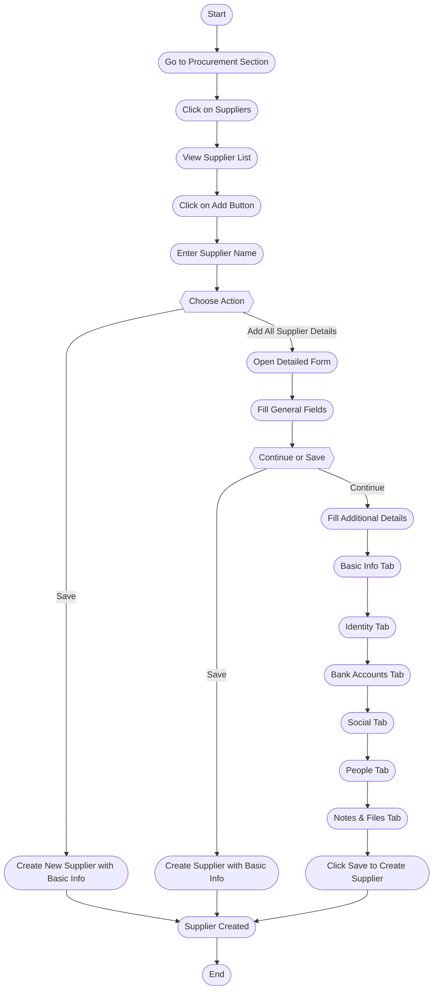

# Suppliers in ERPZ

## Overview

In ERPZ, suppliers are essential business entities that provide the goods and services necessary for production, resale, or internal use. Managing suppliers effectively is crucial for maintaining a smooth supply chain, ensuring timely inventory replenishment, and controlling costs. ERPZ offers a dedicated module for supplier management, which enables businesses to store, track, and monitor supplier information, assess performance, and establish strong, reliable supply relationships.

## 1. Significance of Supplier Management in ERPZ

1. **Efficient Procurement**: Centralized supplier management streamlines procurement, making it easier to place orders, monitor deliveries, and manage payments.

2. **Cost Control**: By tracking supplier performance and terms, ERPZ helps businesses negotiate better pricing, favorable terms, and bulk order discounts.

3. **Quality Assurance**: ERPZ allows for performance tracking, enabling businesses to evaluate suppliers based on the quality of goods and services, delivery times, and responsiveness.

4. **Supply Chain Visibility**: With ERPZ, businesses can maintain complete visibility into supplier inventories, production capabilities, and lead times, reducing the risk of stockouts or production delays.

5. **Regulatory Compliance**: ERPZ aids in maintaining a record of suppliers' certifications and compliance documents, ensuring adherence to industry standards and regulations.

## 2. Key Features of the Suppliers in ERPZ

- **Supplier Directory**: A comprehensive database of all suppliers, including contact information, products, terms, and history.
- **Order Tracking**: Real-time tracking of purchase orders, delivery schedules, and payment statuses.
- **Performance Analytics**: Insights into supplier performance based on metrics like delivery time, quality, and cost-effectiveness.
- **Contract Management**: Tools for managing supplier contracts, terms, and renewals.
- **Risk Management**: Tools for assessing and managing supply chain risks by monitoring supplier stability and reliability.

Effective supplier management in ERPZ enables businesses to build a reliable supply chain, reduce costs, and ensure the quality and availability of products and services needed to meet customer demands.

## 3. Flow Chart of Supplier Quote Creation in ERPZ

### 3.1 Supplier Creation Process Flow Explanation

The supplier creation process in ERPZ is organized into a series of steps, starting from accessing the supplier section and ending with the supplier record creation. Below is a breakdown of each step:

1. **Start**: Begin the process by navigating to the Procurement section in ERPZ.

2. **Go to Procurement Section**: From the dashboard, select the Procurement section and then click on **Suppliers** to view the existing supplier list.

3. **View Supplier List**: Here, you can see all existing suppliers. To add a new one, click the **Add** button at the top-right of the list.

4. **Enter Supplier Name**: A popup will appear where you can enter the supplier’s name. After entering the name, you have two options:
   - **Save**: Creates a new supplier with basic information only.
   - **Add All Supplier Details**: Opens a detailed form to fill in additional information.

5. **Fill General Fields**: In the detailed form, start by completing general fields like name, email, phone, and address. You can either:
   - **Save**: Create the supplier with just these general fields.
   - **Continue**: Move on to the next sections for more details.

6. **Fill Additional Details**: If you choose to continue, there are several tabs to provide more information:
   - **Basic Info**: Add details like country, registration type, and industry.
   - **Identity**: Enter identity information (e.g., MSME, PAN, GSTIN).
   - **Bank Accounts**: Add bank account details.
   - **Social**: Provide links to social media profiles.
   - **People**: Add information about the owner and other contacts.
   - **Notes & Files**: Add notes and upload relevant files or documents.

7. **Final Save**: After filling in all necessary information, click **Save** to create the new supplier record.

8. **Supplier Created**: The new supplier is now successfully created in ERPZ.

This flow ensures all essential details about a supplier are recorded, enabling effective supplier management within ERPZ.

## 4. How to Create a Supplier in ERPZ

To create a supplier in ERPZ, follow these steps:

### 4.1 Access the Supplier Section

1. Navigate to the **Procurement** section from the ERPZ dashboard.
2. In the Procurement section, click on **Suppliers**. This will open a list of all existing suppliers.

> **Dashboard > Procurement > Suppliers**

### 4.2 Start Creating a New Supplier

1. Click the **Add** button located at the top-right corner of the supplier list.

2. A popup window will appear with a **Name** field.

3. Enter the supplier’s name in the field.

4. At this point, you can either:
   - Click **Save** to create a new supplier with minimal information, or
   - Click **Add All Supplier Details** to open a detailed form and provide additional information.

   

### 4.3 Fill Out the General Fields

The detailed form will contain general fields for the supplier:

- **Name** (mandatory): Enter **Name**.
- **Individual** (checkbox, unchecked by default): Check the field if you are an individual supplier.
- **Email** and **Phone**: Enter **Email** and **Phone**.
- **Address** field: To enter an address please click on map icon adjacent to the field. Please refer to [How to Add Address using Map Icon]() to understand the process of adding address.

- **File Uploads** for documents: Upload any related document.

Fill out these fields and click **Save** to create the supplier with basic details, or continue filling out additional sections as described below.

### 4.4 Add Additional Details (Optional)

Below the general fields, there are multiple sections available in tab format. You can switch between these tabs to add more information about the supplier.

#### 4.4.1 Basic Info

The **Basic Info** tab includes fields like:

- **Country** (dropdown): Select a country.
- **Registration Type** (dropdown): Select the type of registraion from the dropdown list.
- **Legal Name**: Enter legal name.
- **Industry Type** (dropdown): Select the type of industry from the dropdown list.
- **Phone**: Enter phone.
- **Address**: To enter an address please click on map icon adjacent to the field. Please refer to [How to Add Address using Map Icon]() to understand the process of adding address.
- **Upload Logo**: Upload any logo if available.

#### 4.4.2 Identity

The **Identity** section contains three areas:

1. **MSME** – Enter **Number**, **Valid From**, **Valid Till**, and **Upload Attachment**.
2. **PAN** – Enter **Number**, **Valid From**, **Valid Till**, and **Upload Attachment**.
3. **GSTIN** – Enter **Number**, **Valid From**, **Valid Till**, and **Upload Attachment**.

#### 4.4.3 Bank Accounts

1. The **Bank Accounts** tab will display any added bank account information.
2. To add a new bank account, click the **Add Account** button, which will open a form in the right drawer of the screen.

3. Fill out the required bank account information and click **Save** to add the new bank account.

#### 4.4.4 Social

The **Social** tab includes fields for various social media links:

- **Facebook**
- **Instagram**
- **Twitter**
- **LinkedIn**
- **YouTube**
- **Snapchat**
- **Website**

#### 4.4.5 People

The **People** tab has two sub-sections: **Owner** and **Contacts**.

1. **Owner** – If the supplier is not an individual, you can add details about the company's owner. Click to edit the owner section and fill in fields of the form.

---

2. **Contacts** – Displays a list of contacts associated with the supplier. To add a new contact, click **Add Contact**, which will open a form in the right drawer. Fill in the contact details and click **Save**.

---

#### 4.4.6 Notes & Files

The **Notes & Files** tab allows you to add additional notes or upload files related to the supplier.

- **Notes** – Enter any additional notes in the text field.
- **Upload Files** – Upload relevant documents or images.

## 4.5 Finalize and Save

After filling out all relevant sections, click **Save** to create the new supplier in ERPZ.

Following these steps ensures a comprehensive profile for each supplier, which helps in maintaining accurate records and managing supplier relationships effectively.

## 6. Supplier Form Features and Field Significance

The supplier form in ERPZ is designed to capture comprehensive details about suppliers, enabling efficient supplier management and smooth procurement processes. Below are the main features of the form and the significance of each section and field.

### 5.1 Key Features of the Supplier Form

1. **General Fields**
   - These fields capture basic supplier information that is essential for identification and communication.

2. **Tab-Based Sections**
   - The form is organized into tabs for easy navigation, allowing users to input various types of information without overwhelming the screen.

3. **Attachment Support**
   - Multiple sections allow document uploads, supporting verification, record-keeping, and documentation of supplier credentials.

4. **Contact Management**
   - The form provides options to add contacts and owners, which is useful for identifying key people in the supplier’s organization.

5. **Social Media Links**
   - Social fields support brand recognition and verification through official social profiles.

### 5.2 Significance of Each Field

#### 5.2.1 General Fields

- **Name**: The supplier's name, a mandatory field that uniquely identifies the supplier.
- **Individual**: A checkbox indicating whether the supplier is an individual or an organization, helping tailor the fields accordingly.
- **Email** and **Phone**: Key contact information for direct communication with the supplier.
- **Address**: The supplier’s location, which is vital for logistics, billing, and shipping coordination.
- **File Uploads**: Allows uploading of essential documents like contracts or certifications for record-keeping.

#### 5.2.2 Basic Info Tab

- **Country**: Identifies the supplier's country, which can influence tax and regulatory requirements.
- **Registration Type**: Indicates the type of supplier registration, helping classify the supplier based on legal status.
- **Legal Name**: The registered name of the supplier, used for formal contracts and legal purposes.
- **Industry Type**: A dropdown that specifies the supplier’s industry, helping in category-based analysis and management.
- **Phone and Address**: Additional fields for alternative contact information and address details.
- **Upload Logo**: Allows adding the supplier's logo, useful for visual identification in reports and dashboards.

#### 5.2.3 Identity Tab

- **MSME**: Micro, Small, and Medium Enterprise number, providing classification details for suppliers in certain categories.
- **PAN**: Permanent Account Number, crucial for tax identification in countries like India.
- **GSTIN**: Goods and Services Tax Identification Number, required for suppliers registered for GST.

Each section (MSME, PAN, GSTIN) includes:
   - **Number**: The ID or registration number, essential for identification and compliance.
   - **Valid From** and **Valid Till**: The validity dates help track active statuses and renewals.
   - **Upload Attachment**: Supports uploading of relevant documents for verification.

#### 5.2.4 Bank Accounts Tab

- **Account Information**: Displays the bank account details associated with the supplier. 
- **Add Account**: Opens a form to add new bank account information, which includes fields for bank name, account number, and IFSC code. This information is critical for transactions and payments.

#### 5.2.5 Social Tab

- **Facebook, Instagram, Twitter, LinkedIn, YouTube, Snapchat, Website**: Links to the supplier’s social media profiles and website. These are useful for verifying legitimacy, understanding the supplier's brand, and establishing a direct connection with their public presence.

#### 5.2.6 People Tab

- **Owner**: Contains fields for the owner’s information if the supplier is not an individual, including:
   - **Name, Gender, Birthday, Phone, Email, Website**: Key contact details about the owner for better communication and relationship management.
- **Contacts**: Displays a list of other contacts within the supplier’s organization.
   - **Add Contact**: Opens a form to enter contact details like name, phone, and email, which helps in managing multiple points of contact.

#### 5.2.7 Notes & Files Tab

- **Notes**: A text field to record additional notes about the supplier, such as special terms, remarks, or internal comments.
- **Upload Files**: Allows uploading documents or images, such as supplier agreements, certifications, or compliance documents, ensuring a complete record of supplier information.

### 5.3 Importance of Each Section

- **General Fields**: Provides quick access to basic, essential details for any initial supplier assessment.
- **Basic Info, Identity, and Bank Accounts**: These tabs ensure legal compliance, accurate payments, and organized supplier categorization.
- **Social and People**: Supports relationship management, offering direct links to important contacts and public profiles for better supplier engagement.
- **Notes & Files**: Offers a space for custom notes and document storage, adding flexibility to store unique or additional information about the supplier.

Each field and section in the supplier form is carefully structured to ensure all necessary supplier details are recorded, making the procurement process streamlined and compliant with ERPZ's standards.

## 6. Conclusion

The supplier form in ERPZ is a comprehensive tool designed to capture and manage essential information about suppliers. By organizing data into intuitive sections and fields, it ensures that all relevant details—such as contact information, legal compliance, banking details, and social presence—are accurately recorded. This robust supplier management system not only simplifies the procurement process but also supports informed decision-making, strengthens supplier relationships, and aids in maintaining compliance. Ultimately, effective supplier management within ERPZ contributes to smoother operations and enhances overall business efficiency.

