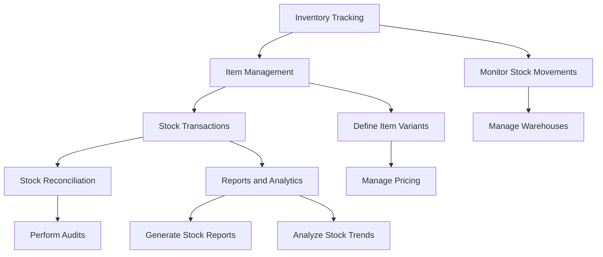

# Introduction to Stock Module in ERPZ

The **Stock module** in ERPZ is a comprehensive tool designed to manage inventory and streamline supply chain operations. It offers various functionalities to handle different aspects of stock management as outlined below:

- **Inventory Tracking**: Monitor stock levels, track movements across warehouses, and manage stock effectively.
  
- **Item Management**: Define and categorize products, track item variants, manage item attributes, and handle pricing.

- **Stock Transactions**: Record and process key transactions such as stock receipts, deliveries, internal transfers, and stock adjustments.

- **Stock Reconciliation**: Perform periodic stock audits to ensure physical inventory matches the recorded stock in the system.

- **Reports and Analytics**: Generate detailed reports on stock levels, valuations, transaction history, and stock trends to support data-driven decision-making.

Overall, the **Stock module** in ERPZ helps businesses maintain optimal inventory levels, reduce carrying costs, and improve operational efficiency across the supply chain.

## Stock Module Process Flow in ERPZ

