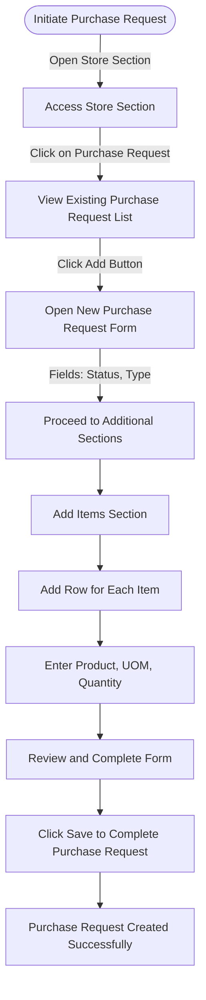

# Purchase Request in ERPZ

A **Purchase Request** in ERPZ is a formal document created to initiate the procurement process for goods or services. This document helps departments or teams within an organization communicate their purchasing needs to the procurement team. It allows for the tracking and approval of procurement requests to ensure that purchasing aligns with the organization’s requirements and budget.

## 1. Purpose of a Purchase Request
- **Identify and Communicate Needs**: A Purchase Request is used to specify items, quantities, and desired delivery timelines, ensuring clarity in procurement needs.
- **Approval Process**: Purchase Requests often go through an approval workflow to verify the necessity and budget availability before proceeding with procurement.
- **Planning and Budgeting**: By consolidating and approving requests, organizations can manage their inventory levels, budget efficiently, and prevent overstocking or shortages.

## 2. Key Elements of a Purchase Request
- **Requested Items**: Details of items or services, including descriptions, quantities, and specifications.
- **Source Information**: Suggested vendors or suppliers, if available.
- **Required Delivery Date**: Timeline for delivery to help in scheduling and stock planning.
- **Cost Estimates**: Approximate costs to ensure the purchase fits within budget constraints.

Using Purchase Requests in ERPZ enhances control over purchasing, streamlines the approval process, and improves transparency and accountability in procurement activities.

## 3. Flow Chart of Purchase Request (PR) Creation in ERPZ

### 3.1 Purchase Request Creation Process Flow

The process of creating a Purchase Request (PR) in ERPZ follows these steps:

1. **Initiate Purchase Request** 
   - Begin by accessing the **Stores** section in ERPZ.

2. **Access Purchase Request List** 
   - Navigate to **Purchase Request** in the Stores section to view the list of existing purchase requests.

3. **Open New Approved PR Form** 
   - Click on the **Add** button to open the form for creating a new Approved PR.

4. **Complete Main Fields** 
   - Fill in essential fields like **Status** (current status of the PR) and **Type** (type of purchase request).

5. **Add Items Section** 
   - Go to the **Items** section and click on **Add Row** to input each item’s details:
     - **Product**: Select the product from a dropdown.
     - **Quantity**: Specify the quantity required.
     - **UOM (Unit of Measure)**: Choose the applicable unit of measure.

6. **Review and Save** 
   - After completing the form, review all entered information.
   - Click **Save** to create the Purchase Request.

7. **Confirmation** 
   - The system will confirm that the Purchase Request has been successfully created.

This structured flow ensures each Purchase Request is documented accurately, ready for the next steps in procurement.

## 4. Creating a Purchase Request in ERPZ

To initiate the procurement of items, ERPZ allows users to create a **Purchase Request** in the Stores section. This request communicates purchasing needs and assists in managing stock levels effectively.

### 4.1 Steps to Create a Purchase Request

1. **Navigate to the Purchase Request Section**  
   - From the ERPZ dashboard, go to the **Stores** section.
   - Select **Purchase Request** to view the list of existing purchase requests.

   > **Dashboard > Stores(Inventory) > Purchase Requests**

   

2. **Adding a New Purchase Request**
   - To create a new request, click the **Add** button located at the top right corner of the list view.
   - This will open a form with fields to specify the details of the new purchase request.

   

3. **Filling in Purchase Request Details**  
   The form contains the following key fields:

   - **Status**: A dropdown list to set the status of the purchase request.

    

    To understand better about all the options available, please refer [Status in ERPZ](/miscellaneous/status-in-erpz) 

   - **Type**: A dropdown list to specify the type of purchase request.

   

4. **Adding Items to the Purchase Request**  
   - Below the main fields is the **Items** section.
   - Click **Add Row** to add items to the purchase request. 

   
   
   A form will appear for each item with the following fields:

   

     - **Product**: Dropdown list to select the product needed.

     

     - **Quantity**: Numeric field to specify the required quantity.

     

     - **UOM (Unit of Measure)**: Dropdown list to choose the appropriate unit of measure.

     

   - Users can add multiple items by repeating this process for each new item.

5. **Saving the Purchase Request** 
   - After filling in all required fields and adding items, click **Save** to create the purchase request.

   

   - The new purchase request will appear in the list view, confirming successful creation.

## 5. Purchase Request (PR) Form Features

The PR form in ERPZ is designed to ensure that all relevant details are captured for a procurement request, supporting efficient processing and authorization. Here’s a breakdown of the key features and the significance of each field.

### 5.1 Form Features

1. **Structured Form Layout** 
   The form is organized into sections, providing a clear layout that guides users through each required detail.

2. **Dropdown Selections**  
   Dropdown lists for fields like **Status**, **Type**, **Product**, and **UOM** make it easy for users to select from predefined options, reducing input errors and maintaining consistency.

3. **Add Items Section** 
   The form allows users to add multiple items through an **Add Row** feature, simplifying the process of adding multiple products in a single PR.

4. **Review and Save Option** 
   Users can review all information before saving, ensuring that the request is complete and accurate.

### 5.2 Significance of Key Fields

1. **Status** 
   - **Purpose**: Specifies the current state of the PR (e.g., Pending, Approved).
   - **Significance**: Allows the procurement team to monitor and manage the lifecycle of the PR, ensuring that only approved requests proceed.

2. **Type** 
   - **Purpose**: Indicates the category or nature of the purchase request (e.g., Raw Materials, Office Supplies).
   - **Significance**: Helps in categorizing PRs for reporting, budget allocation, and analysis, aiding in better financial control.

3. **Items Section** 
   - **Purpose**: Allows users to add multiple items to the PR.
   - **Significance**: Provides flexibility in handling requests for multiple products, each with its unique specifications.

4. **Product** 
   - **Purpose**: Dropdown field to select the specific product needed.
   - **Significance**: Ensures that the correct item is requested, preventing miscommunication or errors in product specification.

5. **Quantity (Qty)** 
   - **Purpose**: Specifies the number of units required.
   - **Significance**: Essential for procurement planning, enabling suppliers to provide accurate quotes and ensuring adequate stock levels.

6. **UOM (Unit of Measure)**  
   - **Purpose**: Defines the measurement unit for the requested quantity (e.g., pieces, kilograms).
   - **Significance**: Ensures clarity in quantity requirements, preventing discrepancies in order fulfillment.

## 6. Conclusion

The Purchase Request (PR) process in ERPZ is a vital component of the procurement workflow, providing a structured method for initiating and managing purchase requests. By capturing essential details through a user-friendly form, the PR system promotes accountability, ensures budget adherence, and facilitates efficient procurement operations. The ability to track and approve requests helps organizations maintain control over spending, optimize supplier interactions, and ultimately streamline the purchasing process. Effective management of PRs not only enhances operational efficiency but also supports informed decision-making, contributing to the overall success of the organization’s procurement strategy.
