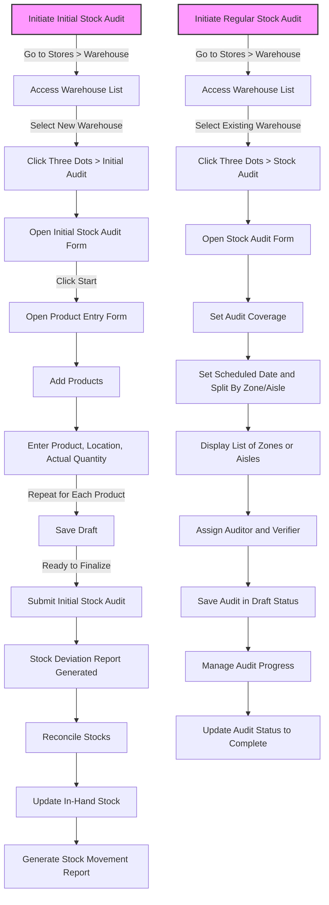

# Stock Audits in ERPZ

In ERPZ, **stock audits** are essential tools for ensuring inventory accuracy and transparency within the system. Stock audits allow businesses to compare actual physical stock against system records, identifying any discrepancies due to damages, misplacements, or errors in previous stock counts. This process helps maintain accurate stock levels, prevent losses, and improve overall stock reliability.

## 1. Significance of Stock Audits in ERPZ

1. **Inventory Accuracy**: Regular stock audits ensure that system records align with actual stock levels, enhancing data accuracy and supporting reliable reporting.

2. **Loss Prevention**: By identifying stock discrepancies early, businesses can mitigate losses from theft, damage, or mismanagement.

3. **Operational Efficiency**: Accurate stock records streamline operations, helping to avoid delays caused by missing or incorrect stock data and supporting timely order fulfillment.

4. **Compliance and Accountability**: Regular audits contribute to better compliance with internal policies and industry standards, fostering accountability across teams handling inventory.

5. **Financial Control**: By keeping inventory levels accurate, stock audits help maintain correct financial records, supporting financial analysis and budgeting.

Stock audits in ERPZ provide a solid foundation for robust inventory management, ensuring that businesses can operate efficiently, minimize waste, and meet customer expectations with confidence.

## 2. Stock Audit Process in ERPZ

Stock audits in ERPZ allow businesses to ensure that actual stock quantities align with recorded data, reducing discrepancies and maintaining accuracy in inventory records. Here, we will walk through the process of conducting **initial stock audits** for new warehouses and **regular stock audits** for existing warehouses, both of which are essential for robust inventory management.

### 2.1 Accessing the Stock Audit List

1. **Navigate to Stores**: From the ERPZ dashboard, go to the **Stores** section.
2. **Open Stock Audits**: Click on **Stock Audits** to view the list of existing stock audits.

> **Dashboard > Stores > Stock Audits**

---
3. **Audit List View**: The list displays stock audits by:
   - **Warehouse**
   - **Number**
   - **Scope** (zone, aisle, etc.)
   - **Scheduled On** date
   - **Audit Type** (initial stock or regular stock audit)
   - **Status**

At the end of each row, there is a three-dot menu that opens options to **edit** or **view** or **delete** specific audit details, including the **Stock Deviation Report**.

---

## 3. Flow Chart of Stock Audit Creation in ERPZ

### 3.1 Initial Stock Audit and Regular Stock Audit Flowchart Explanation

This flowchart illustrates the processes of conducting an **Initial Stock Audit** and a **Regular Stock Audit** in ERPZ. 

1. **Initial Stock Audit Process**:
   - Start by navigating to the **Warehouse** section under **Stores**.
   - Select a new warehouse and initiate an **Initial Audit** by clicking the three dots and choosing the **Initial Audit** option.
   - Complete the **Product Entry Form** by adding products and their respective details (product, location, actual quantity).
   - Save the form as a draft if more edits are needed or submit it to finalize.
   - Once submitted, a **Stock Deviation Report** is generated. Completing reconciliation updates the in-hand stock and creates a **Stock Movement Report**.

2. **Regular Stock Audit Process**:
   - Initiate a regular stock audit from the **Warehouse List** by selecting an existing warehouse and choosing the **Stock Audit** option.
   - Complete the **Stock Audit Form** by setting audit coverage (e.g., zone, aisle), scheduled date, and splitting the audit if necessary.
   - Assign an **Auditor** and **Verifier** for each audit section and save the audit as a draft.
   - Update the audit status based on progress and mark it complete once finished.

This flowchart visually guides users through the steps to ensure accurate stock auditing and management.

## 4. Performing an Initial Stock Audit

Initial stock audits are conducted for newly created warehouses to record starting inventory levels.

### 4.1 Step-by-Step Process

1. **Navigate to Warehouse List**:
   - Go to the **Warehouse** section from **Stores**.
   - The list of warehouses is displayed.

   > **Dashboard > Stores > Warehouses**

   
   ---
   
2. **Initiate Initial Stock Audit**:
   - Locate the new warehouse in the list.
   - Click the three-dot menu at the end of the row and select **Add Initial Stock**.

   
   ---

3. **Starting the Initial Stock Audit**:
   - In the initial audit window, click on **Start** to open the stock entry form.

   
   ---

   

   - Click **Add Products** to open a form where you can specify initial stock details.

   
   ---
   
   
4. **Filling Out the Initial Stock Form**:
   - The **Add Products** form contains the following fields:
     - **Product**: Dropdown list to select the product.
     - **Location**: Warehouse location name. If not available the you can add the location for that warehouse from **Warehouse Locations**. Please refer [Warehouse Locations](/stores/warehouse-location).
     - **Actual Quantity**: Physical count of the product in stock.
   - Add multiple products by clicking **Add More Products** for each additional item.

5. **Saving and Submitting the Initial Stock Audit**:
   - **Save**: Click **Save** to save the draft of the initial stock audit. You can continue to add, edit, or remove products as needed.

   
   ---
   

   - **Submit**: Once all stock entries are finalized, click **Submit** to lock in the audit data. After submission, no further edits are allowed.

   
   ---
   

   - Upon submission, ERPZ generates a **Stock Deviation Report** and creates a **new stock audit entry**.

   
   ---

6. **Reviewing Stock Deviation Report**:
   - In the stock audit list, select **Edit** from the three-dot menu on the audit entry to view the **Stock Deviation Report**.
   - The **Reconcile** button in this report creates individual stock reconciliations for each product, updates **in-hand stock levels**, and generates **Stock Movement Records** and add each product in the **Stocks** list.

   
   ---
   
   ---
   
   ---
   

## 5. Performing a Regular Stock Audit

Regular stock audits ensure ongoing accuracy by auditing zones or sections within existing warehouses.

### 5.1 Step-by-Step Process

1. **Initiate Stock Audit for Existing Warehouse**:
   - From the **Warehouse** list, click the three-dot menu on any existing warehouse and select **Stock Audit**.

   
   ---
   
   ---

2. **Setting Up the Stock Audit Form**:
   - **Warehouse**: Automatically selected based on the chosen warehouse.
   - **Audit Coverage**: Choose the audit coverage level, such as zone or aisle.
   - **Scheduled Date**: Set the date for the audit.
   - **Audit Split**: Select the level for splitting the audit (e.g., zone or aisle).
   
3. **Assigning Audit Responsibilities**:
   - Once a split is selected, ERPZ displays the list of zones or aisles within the warehouse.
   - Assign:
     - **Assigned To**: Person responsible for the audit.

     
     ---
     - **Verifier**: Person responsible for verifying the audit.

     
     ---

4. **Saving and Managing the Audit**:
   - **Save**: Click **Save** to create a stock audit in **Draft** status, visible in the stock audit list.

   
     ---

   - **Status Updates**: The status of the audit can be updated based on the progress (e.g., "In Progress", "Completed").

By following these steps, ERPZ users can conduct thorough stock audits, maintain accurate stock records, and manage warehouse inventories effectively.

## 6. Features and Significance of Add Initail Stock and Stock Audit

### 6.1 Features of Initial Stock Audit

1. **One-time Setup for New Warehouses**: Initial stock audits are performed exclusively for newly created warehouses to establish baseline stock levels.
2. **Comprehensive Product Entry Form**: Enables users to enter essential details for each product, such as location, actual quantity, and more, which sets the initial stock record.
3. **Stock Deviation Report Creation**: Upon submission, generates a stock deviation report to highlight discrepancies.
4. **Stock Reconciliation and Movement Reports**: Automatically reconciles stock levels and creates stock movement records for each item, ensuring that inventory counts are updated system-wide.

### 6.2 Significance of Initial Stock Audit

- **Establishes Initial Stock Levels**: Provides a reliable starting point for tracking stock, ensuring that future audits can detect deviations from the established baseline.
- **Enables Accurate Inventory Data**: Ensures that warehouse records are consistent with physical stock, crucial for effective inventory planning and control.
- **Creates a Basis for Financial Reporting**: Lays the groundwork for accurate valuation and tracking, which is essential for financial audits and reporting.

---

### 6.3 Features of Regular Stock Audit

1. **Scheduled and Recurring Audits**: Allows ongoing inventory audits to be performed on existing warehouses, enabling regular stock checks.
2. **Flexible Audit Coverage**: Can be tailored by zone, aisle, or other specified sections within a warehouse, allowing focused audits.
3. **Assigned Auditor and Verifier Roles**: Each audit section is assigned to an auditor and a verifier, ensuring accountability and accuracy.
4. **Status Tracking**: Supports draft, in-progress, and completed statuses, enabling teams to monitor the audit's progress from start to finish.

### 6.4 Significance of Regular Stock Audit

- **Ensures Consistent Inventory Accuracy**: Helps maintain up-to-date and accurate stock records, minimizing errors from stock discrepancies.
- **Supports Efficient Warehouse Management**: Regular audits improve warehouse organization and efficiency by addressing stock imbalances promptly.
- **Reduces Financial Losses**: Identifies stock shrinkage, pilferage, and damage over time, which can reduce financial losses and enhance profitability.
- **Enhances Operational Transparency**: Increases visibility and control over inventory, providing confidence in the accuracy of stock levels across the organization.

---

In ERPZ, both types of audits play essential roles in supporting effective inventory management. Initial stock audits establish a reliable foundation for new warehouses, while regular audits provide ongoing checks to sustain inventory accuracy and operational efficiency. Together, they enhance the integrity of stock records, enable proactive stock control, and support better decision-making across the organization.

## 7. Conclusion

Stock audits in ERPZ are essential for maintaining inventory accuracy and operational efficiency. By establishing a reliable baseline with initial stock audits and conducting regular checks through recurring audits, ERPZ helps businesses identify discrepancies, minimize losses, and enhance transparency. These audits ensure that stock levels align with real-world quantities, reducing financial risk and supporting informed decision-making.

